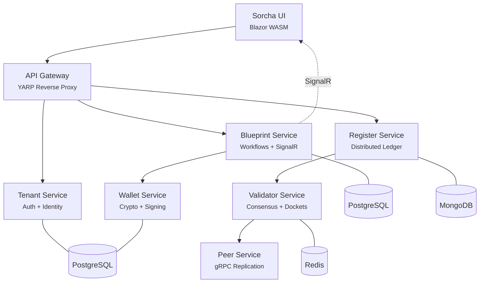

# Sorcha

[](https://github.com/Sorcha-Platform/Sorcha/actions/workflows/nuget-ci.yml)
[](https://github.com/Sorcha-Platform/Sorcha/actions/workflows/docker-ci.yml)
[](https://github.com/Sorcha-Platform/Sorcha/actions/workflows/codeql.yml)
[](LICENSE)

A decentralised register platform for secure, multi-participant data flow orchestration.

Sorcha lets organizations define structured workflows — called **blueprints** — where multiple parties exchange, validate, and record data with cryptographic guarantees. Every transaction is signed, every change is immutable, and every participant sees only what they're authorized to access.

## Try it in one line

With **Docker** and **git** installed, this downloads Sorcha, asks a few setup questions, generates your config, and brings the whole stack up:

**macOS / Linux / WSL / Git Bash**
```bash
curl -fsSL https://raw.githubusercontent.com/Sorcha-Platform/Sorcha/master/scripts/install.sh | bash
```

**Windows PowerShell**
```powershell
irm https://raw.githubusercontent.com/Sorcha-Platform/Sorcha/master/scripts/install.ps1 | iex
```

When it finishes, open **http://localhost/app** and sign in with the credentials it prints. Add `--quiet` for a non-interactive, all-defaults install.

<details><summary>Prefer to read the script before running it? (recommended for any <code>curl | bash</code>)</summary>

```bash
curl -fsSL https://raw.githubusercontent.com/Sorcha-Platform/Sorcha/master/scripts/install.sh -o sorcha-install.sh
less sorcha-install.sh   # review it
bash sorcha-install.sh
```
It clones this repo into `./sorcha` and hands off to [`scripts/sorcha-setup.sh`](scripts/sorcha-setup.sh) — the same interactive setup you can run yourself after a manual `git clone` (see [Quick Start](#quick-start)).
</details>

## What Sorcha Does

| Capability | Description |
|------------|-------------|
| **Blueprint Workflows** | Define multi-step, multi-party data flows as declarative JSON with conditional routing, schema validation, and business logic evaluation |
| **Distributed Ledger** | Immutable, append-only transaction registers with chain validation, Merkle-tree dockets, and DID URI addressing |
| **Cryptographic Wallets** | HD wallet management (BIP32/39/44) with ED25519, P-256, RSA-4096, and post-quantum algorithms (ML-DSA, ML-KEM, SLH-DSA) |
| **Field-Level Encryption** | Envelope encryption with per-recipient key wrapping — participants see only the fields they're authorized to access |
| **Multi-Tenant Identity** | JWT authentication with OAuth2 client credentials, participant identity registry, and wallet address linking |
| **Peer Network** | gRPC-based P2P topology for register replication across nodes |
| **Real-Time Notifications** | SignalR hubs for live action notifications, inbound transaction alerts, and workflow state changes |
| **AI Integration** | MCP Server for AI assistant interaction + AI-assisted blueprint design in the rail-driven Describe → Understand → Rehearse → Go-live designer |

### The DAD Security Model

Sorcha implements **DAD** (Disclosure, Alteration, Destruction):

- **Disclosure** — Field-level encryption and selective disclosure via JSON Pointers ensure participants see only what they're authorized to access
- **Alteration** — Every data change is recorded as a cryptographically signed transaction on an immutable ledger
- **Destruction** — Peer network replication eliminates single-point-of-failure data loss

## Quick Start

Fastest path is the [one-line installer above](#try-it-in-one-line). This section covers the manual equivalent and what the installer does under the hood. For the full quickstart (every prerequisite with version constraint, every common failure mode with documented fix, the verify-installation curl), see **[`docs/quickstart.md`](docs/quickstart.md)** — the canonical, agent-runnable setup reference.

The short version:

### Prerequisites

- Docker Engine ≥ 24 (or Docker Desktop on macOS / Windows)
- Docker Compose v2 (the `docker compose` plugin — v1 standalone is end-of-life and rejected by the setup script)
- OpenSSL **or** Python 3 (for JWT key generation)
- Git
- PowerShell 7.5+ (optional — only needed for `walkthroughs/`)

Ports `80`, `443`, and `8080` must be free.

### Setup

```bash
git clone https://github.com/Sorcha-Platform/Sorcha.git
cd Sorcha

# Interactive setup — checks prerequisites, generates .env, pulls images, starts services
./scripts/sorcha-setup.sh

# Or manual setup:
cp .env.example .env          # Edit with your settings
docker compose up -d          # Start all services
```

On success the script prints `[sorcha-setup] success — gateway reachable at http://localhost`. Verify with `curl -s http://localhost/api/health` — every service should report `Healthy`.

### Access Points

| Service | URL | Description |
|---------|-----|-------------|
| **Sorcha UI** | http://localhost/app | Main application interface |
| **Blueprint Designer** | http://localhost/app/designer/blueprint | Rail-driven designer — Describe → Understand → Rehearse → Go live (Feature 142) |
| **API Gateway** | http://localhost/ | REST API entry point |
| **API Documentation** | http://localhost/scalar/ | Interactive Scalar API docs |
| **Health Check** | http://localhost/api/health | Aggregated service health |
| **Aspire Dashboard** | http://localhost:18888 | Observability and telemetry |

### Default Credentials

After first run, the system creates a default organization and admin user:

| Field | Value |
|-------|-------|
| Email | `admin@sorcha.local` |
| Password | `Dev_Pass_2025!` |

> **Change these immediately in production.** See [Authentication Setup](docs/guides/AUTHENTICATION-SETUP.md) for production configuration.

## How It Works

### 1. Define a Blueprint

Blueprints are JSON documents that describe multi-party workflows:

```json
{
  "title": "Invoice Approval",
  "description": "Two-party invoice submission and approval",
  "participants": [
    { "id": "submitter", "name": "Submitter" },
    { "id": "approver", "name": "Approver" }
  ],
  "actions": [
    {
      "id": 0,
      "title": "Submit Invoice",
      "sender": "submitter",
      "isStartingAction": true,
      "dataSchemas": [
        { "type": "object", "properties": { "amount": { "type": "number" } }, "required": ["amount"] }
      ],
      "routes": [{ "id": "to-review", "nextActionIds": [1], "isDefault": true }],
      "disclosures": [{ "participantAddress": "submitter", "dataPointers": ["/*"] }]
    },
    {
      "id": 1,
      "title": "Review Invoice",
      "sender": "approver",
      "dataSchemas": [
        { "type": "object", "properties": { "decision": { "type": "string", "enum": ["approved", "rejected"] } }, "required": ["decision"] }
      ],
      "routes": [{ "id": "done", "nextActionIds": [], "isDefault": true }],
      "disclosures": [{ "participantAddress": "approver", "dataPointers": ["/*"] }]
    }
  ]
}
```

> Flow uses `routes[]` (`nextActionIds` → action ids; `[]` ends the workflow); one action is the
> open `isStartingAction`; every action declares `disclosures`. See the
> [Blueprint Designer](docs/guides/designer.md) and `blueprint-builder` skill.

See the [blueprints/](blueprints/) directory for ready-to-use templates across finance, healthcare, supply chain, and government domains.

### 2. Publish to a Register

Blueprints are published to **registers** — distributed ledgers that record every transaction immutably. Each register has its own chain of cryptographically signed dockets.

### 3. Execute the Workflow

Participants complete actions in sequence. The engine validates schemas, evaluates business logic, routes to the next participant, and records everything on the ledger.

### 4. Verify and Audit

Every transaction is signed, timestamped, and chained. The full history is available via the REST API or CLI tool.

## CLI Tool

The `sorcha` CLI provides administrative access to the platform:

```bash
# Authenticate
sorcha auth login

# Manage organizations
sorcha org list
sorcha org create --name "Acme Corp" --subdomain acme

# Wallet operations
sorcha wallet list
sorcha wallet create --name "Signing Key" --algorithm ED25519

# Register and transaction management
sorcha register list
sorcha tx submit --register-id reg-123 --payload '{"type":"invoice","amount":1500}'
```

See the [CLI documentation](src/Apps/Sorcha.Cli/README.md) for the full command reference.

## Architecture Overview



| Service | Purpose |
|---------|---------|
| **API Gateway** | YARP reverse proxy — single entry point for all API traffic |
| **Blueprint Service** | Workflow management, execution engine, SignalR notifications |
| **Register Service** | Distributed ledger, transaction storage, OData queries |
| **Wallet Service** | Cryptographic key management, signing, encryption |
| **Tenant Service** | Multi-tenant auth, JWT issuer, participant identity |
| **Validator Service** | Transaction validation, consensus, docket building |
| **Peer Service** | P2P network topology, gRPC replication |
| **HAIP Service** | OpenID4VCI/VP external-wallet surface (credential issue + verify), reached via the gateway |

## Configuration

All configuration is managed through environment variables. See [`.env.example`](.env.example) for a fully documented template with every variable explained.

Key settings:

| Variable | Purpose | Default |
|----------|---------|---------|
| `JWT_SIGNING_KEY` | 256-bit key for JWT tokens | Generated by setup script |
| `POSTGRES_USER` / `POSTGRES_PASSWORD` | PostgreSQL credentials | `sorcha` / `sorcha_dev_password` |
| `MONGO_USERNAME` / `MONGO_PASSWORD` | MongoDB credentials | `sorcha` / `sorcha_dev_password` |
| `ANTHROPIC_API_KEY` | AI blueprint design (optional) | Empty |

## For AI Agents and Integrators

Sorcha publishes a machine-readable surface so AI agents, AI coding assistants, and integrators picking up the platform can find, parse, and reason over it without out-of-band documentation. The four published documents are the canonical agent-facing reference and live alongside the standards file and the well-known endpoints:

| Surface | Purpose |
|---------|---------|
| [`llms.txt`](llms.txt) | One-screen factual summary, llmstxt.org-conforming |
| [`STANDARDS.md`](STANDARDS.md) | Single source of truth for every standard the platform implements |
| [`docs/quickstart.md`](docs/quickstart.md) | Agent-runnable setup against a clean Docker host |
| [`docs/architecture.md`](docs/architecture.md) | Architectural overview — services, evidence flow, discovery surface |
| [`docs/openid4vc-haip-integration.md`](docs/openid4vc-haip-integration.md) | Wallet ecosystem boundary (OpenID4VCI / OpenID4VP / HAIP 1.0) |
| [`docs/applicability.md`](docs/applicability.md) | Regulatory-pull domains (DPP, trade finance, IPC-1782, municipal) |
| [`docs/security-model.md`](docs/security-model.md) | Selective disclosure, post-quantum posture, honest gaps |
| [`docs/mcp-server.md`](docs/mcp-server.md) | Connecting an AI agent via the Model Context Protocol |
| [`docs/llms-full.txt`](docs/llms-full.txt) | Long-form machine-readable narrative |
| `GET /.well-known/openapi.json` *(running gateway)* | Aggregated OpenAPI 3.1 surface with `info.x-mcp-server` and `info.x-standards` |
| `GET /.well-known/openapi.yaml` *(running gateway)* | YAML form of the same document |
| `GET /.well-known/mcp.json` *(running gateway)* | MCP server manifest — transports, authentication, tool catalogue |

These surfaces are gated by the `ai-discoverability-check` CI workflow on every pull request to `master`.

## Project layout

A map of the top-level directories — enough to orient a newcomer. For a full source-tree breakdown see [`docs/reference/project-structure.md`](docs/reference/project-structure.md).

| Directory | Purpose |
|-----------|---------|
| `bench/` | Performance benchmarks and baseline measurement runs |
| `blueprints/` | Blueprint template library: JSON/YAML workflow definitions, schemas, and worked examples |
| `demos/` | Self-contained demo scenarios used for interactive showcases |
| `docker/` | Docker Compose stack, environment-specific app settings, Caddy config, and MCP server setup |
| `docs/` | All project documentation: guides, architecture diagrams, API reference, and getting-started material |
| `infra/` | Infrastructure-as-code (Azure Bicep templates and deployment scripts) |
| `mobile/` | Native mobile client surface: wallet scripts and device-integration assets |
| `ops/` | Operational tooling: Grafana dashboard definitions and runbook helpers |
| `samples/` | Sample integrations and reference portal applications |
| `scripts/` | Developer and CI utility scripts (PowerShell and bash): bootstrap, license headers, key backup |
| `specs/` | Feature specifications and implementation planning documents |
| `src/` | All production source code (Apps, Services, Core, Common, Providers) |
| `tests/` | Cross-service integration and system tests (complements per-project tests inside `src/`) |
| `walkthroughs/` | Interactive guided tutorials and runnable test scripts for key platform flows |

## Documentation

| Document | Description |
|----------|-------------|
| [Docker Quick Start](docs/getting-started/DOCKER-QUICK-START.md) | Getting started with Docker |
| [Authentication Setup](docs/guides/AUTHENTICATION-SETUP.md) | JWT and auth configuration |
| [API Documentation](docs/reference/API-DOCUMENTATION.md) | REST and gRPC endpoint reference |
| [Blueprint Quick Start](docs/getting-started/blueprint-quick-start.md) | Creating your first blueprint |
| [Port Configuration](docs/getting-started/PORT-CONFIGURATION.md) | Service ports and networking |
| [Architecture](docs/architecture.md) | System design and data flows |
| [Deployment Guide](docs/guides/DEPLOYMENT.md) | Production deployment |
| [Troubleshooting](docs/guides/TROUBLESHOOTING.md) | Common issues and solutions |

## Walkthroughs

Interactive demos in the [walkthroughs/](walkthroughs/) directory:

| Walkthrough | Description |
|-------------|-------------|
| `BlueprintStorageBasic/` | Docker startup, bootstrap, JWT authentication |
| `PingPong/` | Simple two-party workflow |
| `ConstructionPermit/` | Multi-step approval process |
| `MedicalEquipmentRefurb/` | Healthcare equipment workflow |
| `OrganizationPingPong/` | Multi-organization data exchange |
| `RegisterCreationFlow/` | Register lifecycle management |

See `walkthroughs/README.md` for the full list and setup instructions.

## Development

For building from source, running tests, project structure, coding conventions, and contributing — see **[DEVELOPMENT.md](DEVELOPMENT.md)**.

## Running the tests

Run the full test suite from the repository root (.NET 10 SDK required — see [DEVELOPMENT.md](DEVELOPMENT.md)):

```bash
dotnet test
```

For filtered runs, coverage collection, and other test options, see **[DEVELOPMENT.md](DEVELOPMENT.md)**.

## License

MIT License — see [LICENSE](LICENSE) for details.

## Links

- [GitHub Issues](https://github.com/Sorcha-Platform/Sorcha/issues)
- [GitHub Discussions](https://github.com/Sorcha-Platform/Sorcha/discussions)
- [Contributing Guide](CONTRIBUTING.md)
- [Security Policy](SECURITY.md)
- [Changelog](CHANGELOG.md)

---

Built with .NET 10 and .NET Aspire
