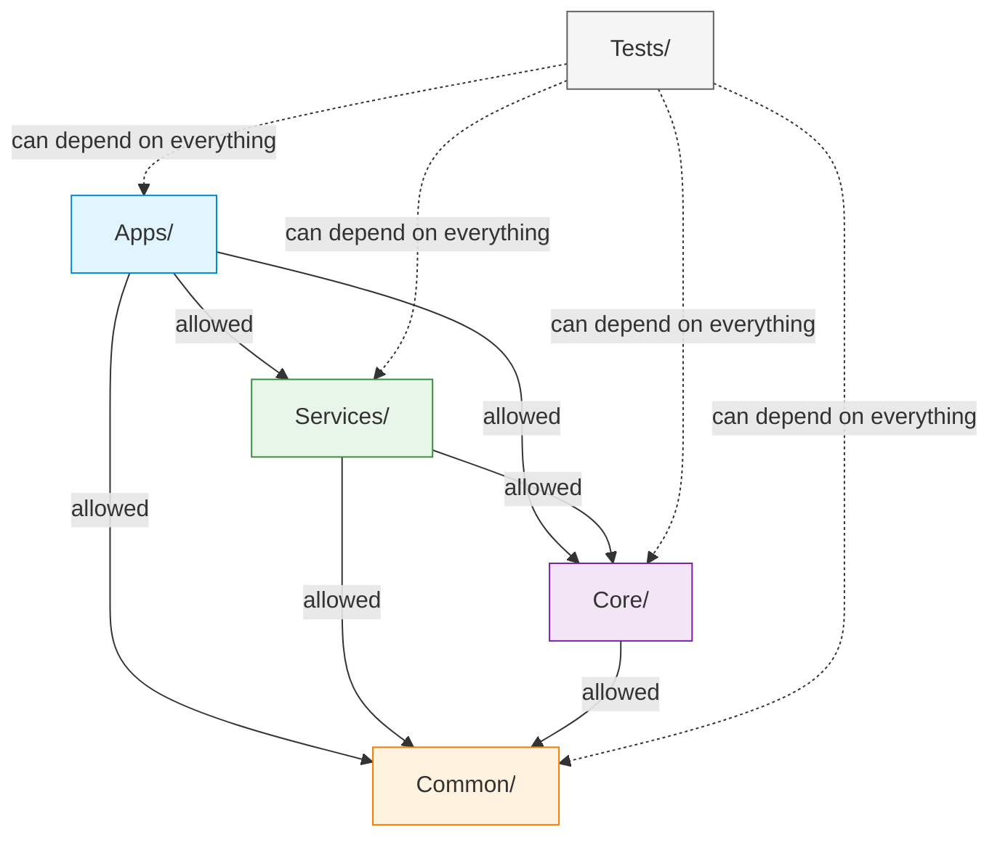

# Sorcha Project Structure

## Overview

Sorcha is organised around layered tiers (Apps / Services / Core / Common, plus a small `Providers/` tier for pluggable infrastructure) with a dedicated `tests/` root and top-level support directories for docs, specs, blueprints, walkthroughs, infra, and tooling.

**Last Updated:** 2026-06-03
**Version:** 3.1.0

## Directory Structure

```
Sorcha/
├── src/
│   ├── Apps/                                   # Entry-point applications
│   │   ├── Sorcha.Agent/                       # Autonomous actor agent CLI
│   │   ├── Sorcha.AppHost/                     # .NET Aspire orchestration host
│   │   ├── Sorcha.Cli/                         # Administrative CLI (System.CommandLine + Refit + Spectre.Console)
│   │   ├── Sorcha.Demo/                        # Demo application
│   │   ├── Sorcha.McpServer/                   # MCP Server for AI assistants (Claude Desktop, etc.)
│   │   ├── Sorcha.Verifier/                    # Reference OID4VP verifier (Blazor Server)
│   │   ├── Sorcha.Wallet.Pwa/                  # Citizen wallet PWA (Blazor WASM, Feature 114)
│   │   └── Sorcha.UI/                          # Main user-facing UI (Blazor WASM)
│   │       ├── Sorcha.UI.Core/                 # Shared admin/designer/explorer UI components
│   │       ├── Sorcha.UI.Components.User/      # Shared user-facing components, web + PWA (Feature 122)
│   │       ├── Sorcha.UI.Web/                  # Web host
│   │       ├── Sorcha.UI.Web.Client/           # Web client (Blazor WASM)
│   │       └── tests/                          # UI-scoped test projects
│   │           ├── Sorcha.UI.Core.Tests/
│   │           └── Sorcha.UI.Integration.Tests/
│   ├── Common/                                 # Cross-cutting libraries (no business logic)
│   │   ├── Sorcha.AddressLookup/               # Postal-address lookup abstractions
│   │   ├── Sorcha.AtomicCache/                 # IAtomicDistributedCache (GETDEL + Lua CAS primitive)
│   │   ├── Sorcha.Blueprint.Models/            # Blueprint domain models + JSON-LD
│   │   ├── Sorcha.Blueprint.Schemas/           # Schema definitions (shared)
│   │   ├── Sorcha.CitizenWallet.Abstractions/  # Citizen-wallet DTOs, derivation contexts, VCT URIs (F114)
│   │   ├── Sorcha.Cryptography/                # Multi-algorithm crypto (ED25519, P-256, RSA-4096) + SD-JWT + mdoc
│   │   ├── Sorcha.PresentationLifecycle.Abstractions/ # Cross-consumer presentation-lifecycle contract (F111)
│   │   ├── Sorcha.Register.Models/             # Register domain models + genesis resources
│   │   ├── Sorcha.ServiceClients/              # Consolidated HTTP/gRPC clients
│   │   ├── Sorcha.ServiceClients.Http/         # HTTP REST clients + SignalR (NuGet, mobile-friendly)
│   │   ├── Sorcha.ServiceDefaults/             # Aspire shared config, rate limiting, tiered-audience auth, storage audit
│   │   ├── Sorcha.Storage.Abstractions/        # Storage seams: ICacheStore, IDocumentStore, IWormStore, IVerifiedCache
│   │   ├── Sorcha.Storage.InMemory/            # In-memory implementation (testing)
│   │   ├── Sorcha.Storage.MongoDB/             # MongoDB implementation
│   │   ├── Sorcha.Storage.Redis/               # Redis caching implementation
│   │   ├── Sorcha.Tenant.Models/               # Tenant domain models
│   │   ├── Sorcha.TransactionHandler/          # Transaction building/serialization
│   │   ├── Sorcha.Validator.Core/              # Enclave-safe validation library
│   │   └── Sorcha.Verifier.Engine/             # WASM-friendly OID4VP presentation validator + issuer-key resolvers
│   ├── Core/                                   # Business logic
│   │   ├── Sorcha.Blueprint.Engine/            # Portable execution (WASM-compatible) + credential trust/format handlers
│   │   ├── Sorcha.Blueprint.Fluent/            # Fluent API for blueprint construction
│   │   ├── Sorcha.Blueprint.Schemas.Client/    # Client-side schema facade
│   │   ├── Sorcha.Register.Core/               # Ledger business logic + LocalRelationship + SyncState
│   │   ├── Sorcha.Register.Storage/            # Register-specific storage abstractions
│   │   ├── Sorcha.Register.Storage.InMemory/
│   │   ├── Sorcha.Register.Storage.MongoDB/
│   │   ├── Sorcha.Register.Storage.Redis/
│   │   ├── Sorcha.Wallet.Core/                 # Wallet business logic
│   │   └── Sorcha.Wallet.Portable/             # Portable wallet: entities, enums, derivation (NuGet)
│   ├── Providers/                              # Pluggable infrastructure providers
│   │   └── Sorcha.Wallet.Providers.Azure/      # Azure Key Vault / KMS-resident wallet key protection
│   └── Services/                               # REST / gRPC / background services
│       ├── Sorcha.ApiGateway/                  # YARP reverse proxy
│       ├── Sorcha.Blueprint.Service/           # Workflow management + SignalR
│       ├── Sorcha.Haip.Service/                # HAIP presentation / verified credential gateway
│       ├── Sorcha.Peer.Service/                # P2P networking (gRPC)
│       ├── Sorcha.Register.Service/            # Distributed ledger + OData
│       ├── Sorcha.Tenant.Service/              # Multi-tenant auth, JWT, Participant/Platform Identity
│       ├── Sorcha.Validator.Service/           # Consensus + chain integrity
│       └── Sorcha.Wallet.Service/              # Crypto wallet management
├── tests/                                      # ~52 top-level test projects (plus 2 UI-scoped tests under src/Apps/Sorcha.UI/tests)
│   ├── Sorcha.Testing/                         # Shared test factory / fixtures
│   ├── {Project}.Tests/                        # Unit tests
│   ├── {Project}.IntegrationTests/             # Integration tests (real DB/services)
│   ├── Sorcha.Performance.Tests/               # Load / TPS benchmarks
│   ├── Sorcha.TransactionHandler.Benchmarks/   # BenchmarkDotNet benchmarks
│   └── Sorcha.UI.E2E.Tests/                    # Playwright end-to-end tests
├── docs/                                       # Documentation
│   ├── getting-started/
│   ├── guides/
│   └── reference/                              # project-structure.md (this file), API-DOCUMENTATION.md, architecture.md, etc.
├── specs/                                      # Feature specs (speckit)
├── blueprints/                                 # Canonical blueprint JSON templates
├── walkthroughs/                               # Interactive demo + test scripts (see walkthroughs/README.md)
├── scripts/                                    # Build, deploy, and n1 management scripts
├── infra/                                      # Infrastructure as Code
├── docker/                                     # Docker build contexts
├── e2e/                                        # Top-level E2E support
├── docker-compose*.yml                         # Compose overlays (debug, federation, infrastructure, n1, ports, seed)
├── Directory.Packages.props                    # Central package version management
└── Sorcha.sln                                  # Solution file
```

**Counts (2026-06-03):** 7 standalone App projects + 4 UI projects (under `Sorcha.UI/`), 19 Common libraries, 10 Core libraries, 1 Providers project, 8 Services. Tests: ~52 top-level test projects (under `tests/`) + 2 UI-scoped test projects (under `src/Apps/Sorcha.UI/tests/`).

## Layer Purposes

### src/Apps/

Entry-point applications: Aspire host, UI, CLIs, and standalone agents. Projects here compose the lower layers but do not themselves ship business logic. The `Sorcha.UI` folder is internally structured as its own solution (`Sorcha.UI.sln`) with host, client, and test projects so UI work can be opened in isolation.

### src/Common/

Cross-cutting libraries. Contents: domain models, cryptography, storage abstractions and implementations, consolidated service clients, service defaults (telemetry, rate limiting, auth wiring), transaction handling, and enclave-safe validator core. No upward dependencies on Core / Services / Apps.

### src/Core/

Domain business logic — execution engines, ledger core, schema management, fluent builders, portable wallet. Depends on Common only.

### src/Providers/

Pluggable infrastructure providers selected by configuration — e.g. `Sorcha.Wallet.Providers.Azure` supplies Azure Key Vault / KMS-resident wallet key protection behind the Wallet Service's key-protection seam. Kept separate so a deployment pulls in only the cloud providers it uses.

### src/Services/

REST, gRPC, and background services. Each service owns its endpoints, mappers, DTOs, and business wiring, delegating domain logic down to Core and infrastructure to Common. Currently 8 services: API Gateway, Blueprint, HAIP, Peer, Register, Tenant, Validator, Wallet.

### tests/

Top-level test root. Naming: `{Project}.Tests` for unit, `{Project}.IntegrationTests` (or `.Integration.Tests`) for integration, `.E2E.Tests` for end-to-end, `.Benchmarks` for BenchmarkDotNet harnesses. `Sorcha.Testing` is a shared test-utilities project consumed by others. UI-scoped test projects live under `src/Apps/Sorcha.UI/tests/` so they travel with the UI solution.

## Dependency Rules



**Forbidden:** Common → Core / Services / Apps. Core → Services / Apps. Services → Apps.

## Target Framework

All projects target **`net10.0`** (C# 14). Central package management via `Directory.Packages.props` at the repo root.

## Naming Conventions

| Layer | Pattern | Examples |
|-------|---------|----------|
| Apps | `Sorcha.{Feature}` | `Sorcha.AppHost`, `Sorcha.Cli`, `Sorcha.Agent`, `Sorcha.McpServer` |
| Services | `Sorcha.{Feature}.Service` or `Sorcha.{Feature}Gateway` | `Sorcha.Register.Service`, `Sorcha.ApiGateway`, `Sorcha.Haip.Service` |
| Common | `Sorcha.{Feature}` or `Sorcha.{Feature}.{Kind}` | `Sorcha.Cryptography`, `Sorcha.Storage.MongoDB`, `Sorcha.ServiceClients.Http` |
| Core | `Sorcha.{Feature}.{Kind}` | `Sorcha.Blueprint.Engine`, `Sorcha.Register.Core`, `Sorcha.Wallet.Portable` |
| Tests | `{Project}.Tests` / `{Project}.IntegrationTests` / `{Project}.E2E.Tests` / `{Project}.Benchmarks` | `Sorcha.Register.Core.Tests`, `Sorcha.Wallet.Service.IntegrationTests`, `Sorcha.UI.E2E.Tests` |

## Adding a New Project

1. Choose layer by purpose (entry-point → Apps, domain logic → Core, infrastructure/shared → Common, API/service → Services).
2. Match naming conventions above.
3. Target `net10.0`; rely on `Directory.Packages.props` for package versions (no inline `Version=` attributes on `PackageReference`).
4. Add to the solution: `dotnet sln add src/{Layer}/{Name}/{Name}.csproj`.
5. Create a matching test project under `tests/` (or under `src/Apps/Sorcha.UI/tests/` for UI-internal tests).
6. Verify layer dependency rules hold (no upward refs).
7. Update this file and, if the project adds new endpoints or cross-cutting patterns, update `CLAUDE.md`, `docs/reference/API-DOCUMENTATION.md`, and the relevant skill under `.claude/skills/`.

## Common Mistakes

- **Business logic in `Common/`** — move to `Core/`. `Common/` is for models, abstractions, and framework-agnostic utilities.
- **Inline package versions** — central versioning lives in `Directory.Packages.props`; adding `Version=` to a `PackageReference` breaks the build.
- **Circular refs** — `Common/` never depends on `Core/` / `Services/` / `Apps/`.
- **Test project in the wrong root** — UI-scoped tests belong under `src/Apps/Sorcha.UI/tests/`; everything else under top-level `tests/`.
- **Missing `Sorcha.Testing` reference** — integration tests should consume the shared factory rather than rolling their own service bootstraps.

## Related Documentation

- [`architecture.md`](../architecture.md) — Service diagrams and runtime topology
- [`API-DOCUMENTATION.md`](API-DOCUMENTATION.md) — Full REST / gRPC endpoint reference
- [`development-status.md`](development-status.md) — Per-service completion status
- [`../getting-started/`](../getting-started/) — First-run setup
- [`../../CLAUDE.md`](../../CLAUDE.md) — Development guidelines, critical patterns, AI assistant requirements
- [`../../.claude/skills/sorcha-architecture/SKILL.md`](../../.claude/skills/sorcha-architecture/SKILL.md) — Feature-specific API references and cross-cutting patterns
