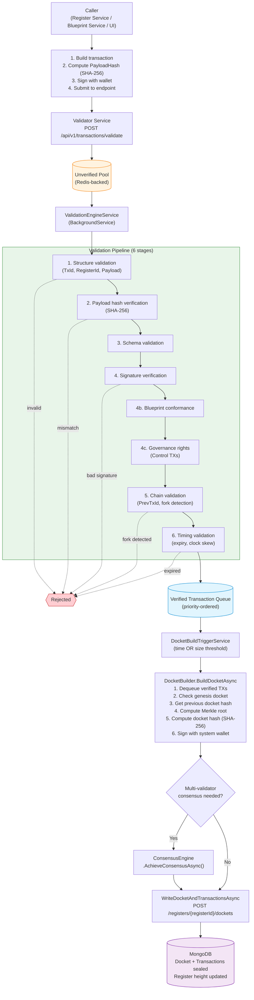

# Transaction Submission Flow Analysis

**Created:** 2026-02-18
**Updated:** 2026-02-18
**Status:** Research / P0 Investigation
**Related:** MASTER-TASKS.md, VALIDATOR-SERVICE-REQUIREMENTS.md

---

## Design Principle

**There is ONE generic transaction submission endpoint.** All transaction types — genesis, control, action, governance — are structurally the same: they carry a payload, a payload hash, signatures, and metadata. The validator does not care about the semantic type; it validates structure, hashes, signatures, and chain integrity uniformly.

Genesis is not a separate protocol — it is a normal transaction with:
- `BlueprintId = "genesis"`
- `ActionId = "register-creation"`
- `Metadata.Type = "Genesis"`
- System wallet signature (provided by the caller, NOT by the validator)

The validator's job is to **validate**, not to **sign**. Signing is always the caller's responsibility.

---

## Target Architecture

<!-- Original ASCII preserved for reference
Caller (Register Service / Blueprint Service / UI)
    │  1. Build transaction  2. Compute PayloadHash (SHA-256)
    │  3. Sign with wallet   4. Submit to generic endpoint
    ▼
Validator Service — POST /api/v1/transactions/validate
    ▼
Unverified Pool (Redis-backed)
    ▼
ValidationEngineService (BackgroundService) — polls monitored registers
    ▼
Validation Pipeline (6 stages): Structure → Hash → Schema → Signature →
    Blueprint conformance → Governance → Chain → Timing
    ▼
Verified Transaction Queue (priority-ordered)
    ▼
DocketBuildTriggerService — time or size threshold
    ▼
DocketBuilder — dequeue, merkle root, hash, sign
    ▼
Consensus (if multi-validator)
    ▼
WriteDocketAndTransactionsAsync → Register Service → MongoDB
-->

---

## Transaction Types

All types use the same `ValidateTransactionRequest` model. The type is distinguished by `BlueprintId`, `ActionId`, and `Metadata`.

### 1. Genesis (Register Creation)

- **Submitted by:** RegisterCreationOrchestrator
- **BlueprintId:** `"genesis"` (`GenesisConstants.BlueprintId`)
- **ActionId:** `"register-creation"` (`GenesisConstants.ActionId`)
- **Signed by:** System wallet (caller obtains system wallet from Wallet Service and signs before submission)
- **Metadata:** `Type=Genesis`, `RegisterName`, `TenantId`, `SystemWalletAddress`
- **Docket:** Genesis docket (number 0) created by GenesisManager when register height == 0
- **Priority:** High

### 2. Blueprint Publish (Control)

- **Submitted by:** Register Service publish endpoint
- **BlueprintId:** Actual blueprint ID (e.g., `"7f3f88d6-1fcc-4231-b3a4-17874540802e"`)
- **ActionId:** `"blueprint-publish"`
- **Signed by:** System wallet (caller signs via Wallet Service)
- **Metadata:** `Type=Control`, `transactionType=BlueprintPublish`, `publishedBy=...`
- **Docket:** Normal docket (number N+1)
- **Priority:** High

### 3. Action (Blueprint Execution)

- **Submitted by:** Blueprint Service
- **BlueprintId:** Blueprint being executed
- **ActionId:** Current action step (string representation of action ID)
- **Signed by:** User's wallet (externally signed before submission)
- **Metadata:** Optional
- **Docket:** Normal docket
- **Priority:** Normal

### 4. Governance (Control)

- **Submitted by:** Register Service governance endpoints
- **BlueprintId:** `"register-governance-v1"`
- **ActionId:** Operation type (e.g., `"add-member"`, `"remove-member"`, `"transfer-ownership"`)
- **Signed by:** Proposer's wallet + quorum signatures
- **Metadata:** `Type=Control`, `transactionType=Control`
- **Priority:** High

---

## Current State vs Target

### What exists today

| Endpoint | Purpose | Status |
|----------|---------|--------|
| `POST /api/v1/transactions/validate` | Generic transaction submission | Working (used by Blueprint Service for action TXs) |
| `POST /api/validator/genesis` | Genesis/Control TX submission | Working but WRONG approach |

### Problem: The genesis endpoint signs transactions

The `/api/validator/genesis` endpoint currently:
1. Accepts unsigned transactions from callers
2. **Signs them with the system wallet internally**
3. Constructs the `Transaction` object with genesis defaults
4. Submits to the unverified pool

This violates the separation of concerns. The validator should **validate**, not **sign**. The signing responsibility belongs to the caller.

### Problem: Two different request models

- `ValidateTransactionRequest` — used by generic endpoint (BlueprintId, ActionId, Payload, Signatures required)
- `GenesisTransactionRequest` — used by genesis endpoint (ControlRecordPayload, optional overrides, NO required signatures)

These should be ONE model. A genesis transaction is structurally identical to any other transaction.

### Problem: Blueprint publish uses the genesis endpoint

The Register Service publish endpoint (`/api/registers/{registerId}/blueprints/publish`) currently submits via `SubmitGenesisTransactionAsync()` which hits `/api/validator/genesis`. This is wrong — blueprint publish is not genesis. It should submit to the generic endpoint like any other transaction.

---

## Refactoring Plan

### Phase 1: Move signing to callers

1. **RegisterCreationOrchestrator** — Already has `IWalletServiceClient`. After constructing the genesis transaction, call `walletClient.SignTransactionAsync()` with the system wallet to produce a signature. Then submit the fully-signed transaction to the generic `/api/v1/transactions/validate` endpoint using `SubmitTransactionAsync()`.

2. **Register Service publish endpoint** — Inject `IWalletServiceClient`. Sign the blueprint publish transaction with the system wallet before submission. Use `SubmitTransactionAsync()` instead of `SubmitGenesisTransactionAsync()`.

3. **Governance endpoints** — Already have user wallet signatures from the proposer. Submit via `SubmitTransactionAsync()`.

### Phase 2: Update the generic endpoint

The generic `/api/v1/transactions/validate` endpoint already accepts all required fields. No changes needed to the request model — `ValidateTransactionRequest` already has:
- `TransactionId`, `RegisterId`, `BlueprintId`, `ActionId`
- `Payload` (JsonElement), `PayloadHash`
- `Signatures[]` (base64 PublicKey, SignatureValue, Algorithm)
- `CreatedAt`, `ExpiresAt?`, `PreviousTransactionId?`
- `Priority`, `Metadata`

The only potential change: ensure the validation pipeline handles transactions with `BlueprintId = "genesis"` without rejection (structure validation, blueprint conformance, etc.)

### Phase 3: Deprecate the genesis endpoint

Once all callers use the generic endpoint:
1. Mark `/api/validator/genesis` as deprecated
2. Eventually remove it
3. Remove `GenesisTransactionSubmission`, `GenesisTransactionRequest` models
4. Remove `SubmitGenesisTransactionAsync()` from `IValidatorServiceClient`

### Phase 4: Ensure validation pipeline is type-agnostic

The ValidationEngine should handle all transaction types uniformly:
- **Signature verification**: Same for all types — verify provided signatures against payload
- **Blueprint conformance**: Skip for genesis/control (BlueprintId = "genesis" or metadata Type = "Control")
- **Chain validation**: Same for all types — check PrevTxId continuity
- **Schema validation**: Skip for genesis/control (no schema defined)

---

## Known Issues

### Issue 1: Validator Stuck in Initialization Loop

**Symptom:** Validator logs show repeated `RegisterServiceClient initialized` / `WalletServiceClient initialized` messages every ~10 seconds with no actual transaction processing.

**Possible causes:**
- No registers in the `IRegisterMonitoringRegistry` (nothing to monitor)
- Service client initialization failing and retrying
- Background services not starting properly

**Investigation needed:**
- Check if `monitoringRegistry.RegisterForMonitoring()` was called after genesis
- Check if `ValidationEngineService` and `DocketBuildTriggerService` are running
- Verify Redis connectivity for the transaction pool

### Issue 2: Stale Direct-Write Transaction

**Symptom:** A blueprint publish transaction was previously stored directly to MongoDB via `transactionManager.StoreTransactionAsync()` without going through the validator. This transaction:
- Exists in the ledger without a docket
- Has no system wallet signature
- Was never validated

**Impact:** The register now has an orphan transaction that doesn't belong to any docket. The chain integrity may be broken.

**Resolution options:**
1. Delete the orphan transaction from MongoDB manually
2. Leave it — the docket builder only processes transactions from the verified queue
3. The WriteDocket endpoint handles duplicate transactions gracefully (DuplicateKey catch)

### Issue 3: WriteDocket Endpoint Authorization

**Concern:** The `/api/registers/{registerId}/dockets` POST endpoint requires `CanWriteDockets` authorization policy. The validator service must authenticate with the register service to write dockets.

**Check:** Verify the validator's service-to-service JWT includes the required claims for `CanWriteDockets`.

### Issue 4: Genesis Signature Verification

**Concern:** The genesis endpoint currently skips signature verification in `ValidationEngine.VerifySignaturesAsync()` for transactions with `BlueprintId = "genesis"`. When we move signing to callers and use the generic endpoint, we need to ensure:
- The generic endpoint validates genesis signatures normally
- The ValidationEngine doesn't skip signature checks for genesis BlueprintId
- The signing data format matches what `VerifySignaturesAsync` expects: `SHA-256("{TxId}:{PayloadHash}")`

### Issue 5: System Wallet Availability

**Concern:** When signing moves to the caller (Register Service), the Register Service needs access to the system wallet. Currently:
- RegisterCreationOrchestrator already has `IWalletServiceClient` and calls `CreateOrRetrieveSystemWalletAsync`
- The genesis endpoint has retry/recreate logic for unavailable wallets
- This wallet management logic needs to be available to all callers that submit system-signed transactions

**Recommendation:** Create a `ISystemWalletSigningService` in `Sorcha.ServiceClients` that encapsulates:
1. Getting/creating the system wallet address
2. Signing data with the system wallet
3. Retry/recreate on wallet unavailability

**Security Requirements for ISystemWalletSigningService:**

This service is the keys to the kingdom — any component that can resolve it can create system-signed transactions (genesis, control, blueprint publish). It must be designed with least-privilege from the start.

1. **DI registration scope** — Only register in services that genuinely need system-level signing (Register Service, Validator Service). Never register in Blueprint Service, UI, Tenant Service, or anything externally-facing. Enforce this via explicit opt-in registration (`AddSystemWalletSigning()`) rather than automatic inclusion in `AddServiceClients()`.

2. **Audit logging** — Every system wallet sign call MUST log: caller service identity, register ID, transaction type (from metadata), resulting TxId, derivation path used, and timestamp. This is non-negotiable for forensics and incident investigation.

3. **Operation whitelist** — The service MUST enforce an allowed set of derivation paths / signing purposes. Only permit known operations:
   - `sorcha:register-control` — genesis and control transactions
   - `sorcha:docket-signing` — docket creation (validator only)
   - Reject any unrecognised derivation path with a clear error

4. **Rate limiting** — Enforce a configurable cap on system signs per register per time window (e.g. max 10 signs per register per minute). This catches runaway callers, infinite loops, and potential abuse early. Rate limit state can be in-memory (per-process) since system signing is always service-to-service.

5. **Caller identity validation** — The service should validate that the calling context has appropriate service-level claims (e.g. `CanSignSystem` claim in the service JWT). This prevents accidental injection into services that shouldn't have signing capability.

---

## Key Files

| Component | File | Purpose |
|-----------|------|---------|
| Generic endpoint | `src/Services/Sorcha.Validator.Service/Endpoints/ValidationEndpoints.cs` | `ValidateTransaction` — accepts all transaction types |
| ~~Genesis endpoint~~ | ~~Same file~~ | ~~Removed in 036~~ — all types now use generic endpoint |
| System wallet signing | `src/Common/Sorcha.ServiceClients/SystemWallet/SystemWalletSigningService.cs` | Centralized system wallet signing with whitelist, rate limiting, audit logging |
| Validation engine | `src/Services/Sorcha.Validator.Service/Services/ValidationEngine.cs` | 6-stage validation pipeline |
| Validation poller | `src/Services/Sorcha.Validator.Service/Services/ValidationEngineService.cs` | Background polling of unverified pool |
| Docket builder | `src/Services/Sorcha.Validator.Service/Services/DocketBuilder.cs` | Builds dockets from verified transactions |
| Docket trigger | `src/Services/Sorcha.Validator.Service/Services/DocketBuildTriggerService.cs` | Monitors thresholds, triggers builds |
| Genesis manager | `src/Services/Sorcha.Validator.Service/Services/GenesisManager.cs` | Creates genesis dockets (height=0) |
| Transaction pool | `src/Services/Sorcha.Validator.Service/Services/TransactionPoolPoller.cs` | Redis-backed unverified pool |
| Verified queue | `src/Services/Sorcha.Validator.Service/Services/VerifiedTransactionQueue.cs` | In-memory verified queue |
| Monitoring registry | `src/Services/Sorcha.Validator.Service/Services/RegisterMonitoringRegistry.cs` | Tracks active registers |
| Consensus engine | `src/Services/Sorcha.Validator.Service/Services/ConsensusEngine.cs` | Multi-validator consensus |
| WriteDocket endpoint | `src/Services/Sorcha.Register.Service/Program.cs` (~line 1031) | Receives dockets from validator |
| Publish endpoint | `src/Services/Sorcha.Register.Service/Program.cs` (~line 1108) | Blueprint publish — needs refactoring |
| Orchestrator | `src/Services/Sorcha.Register.Service/Services/RegisterCreationOrchestrator.cs` | Genesis flow — needs refactoring |
| Validator client | `src/Common/Sorcha.ServiceClients/Validator/ValidatorServiceClient.cs` | HTTP client to validator |
| Validator client interface | `src/Common/Sorcha.ServiceClients/Validator/IValidatorServiceClient.cs` | Client contracts |
| Transaction manager | `src/Core/Sorcha.Register.Core/Managers/TransactionManager.cs` | Direct MongoDB operations (should NOT be used for submission) |

---

## Action Items

### Completed (036-unified-transaction-submission)

1. ~~**Refactor blueprint publish**~~ ✅ Now uses `ISystemWalletSigningService.SignAsync()` + `SubmitTransactionAsync()` (generic endpoint).

2. ~~**Refactor RegisterCreationOrchestrator**~~ ✅ Now uses `ISystemWalletSigningService.SignAsync()` + `SubmitTransactionAsync()`.

3. ~~**Create ISystemWalletSigningService**~~ ✅ Created at `src/Common/Sorcha.ServiceClients/SystemWallet/` with whitelist, rate limiting, audit logging, and wallet caching.

4. **Investigate validator initialization loop** — 📋 Not yet resolved. Still needs investigation.

5. **Clean up orphan transaction** — 📋 Not yet resolved. Requires MongoDB admin access.

6. ~~**Deprecate genesis endpoint**~~ ✅ Removed entirely — `POST /api/validator/genesis` no longer exists.

7. ~~**Audit ValidationEngine for type-specific logic**~~ ✅ Removed signature verification skip for genesis/control. Schema/blueprint conformance skips remain correct.

8. **Wire governance endpoints** through the generic submission path — 📋 Not yet done.

9. ~~**Audit all transaction write paths**~~ ✅ Full audit in research R3. See tech debt below.

10. ~~**Remove genesis endpoint**~~ ✅ Removed endpoint, models (`GenesisTransactionSubmission`, `GenesisTransactionRequest`, `GenesisSignature`), and client method (`SubmitGenesisTransactionAsync`).

11. ~~**Unify service client**~~ ✅ Single `SubmitTransactionAsync()` on `IValidatorServiceClient` using `TransactionSubmission` (renamed from `ActionTransactionSubmission`).

### Known Tech Debt: Direct-Write Paths That Bypass Validator

The following paths write transactions directly to the Register Service, bypassing the validator pipeline. These were identified during the 036 audit (research R3) and are documented here for future remediation.

| # | Path | Source File | Current Target | Risk |
|---|------|-------------|---------------|------|
| 6 | Action execution endpoint | `src/Services/Sorcha.Blueprint.Service/Program.cs` (~line 880) | `POST /api/registers/{id}/transactions` (DIRECT) | **HIGH**: Creates unsigned/unvalidated action transactions |
| 7 | Action rejection endpoint | `src/Services/Sorcha.Blueprint.Service/Program.cs` (~line 1031) | `POST /api/registers/{id}/transactions` (DIRECT) | **HIGH**: Creates unsigned/unvalidated rejection transactions |
| 8 | Validator registration | `ValidatorRegistry.cs` (~line 305) | `POST /api/registers/{id}/transactions` (DIRECT) | **MEDIUM**: Chicken-and-egg — validator registers itself |
| 9 | Validator approval | `ValidatorRegistry.cs` (~line 483) | `POST /api/registers/{id}/transactions` (DIRECT) | **MEDIUM**: Validator approves other validators |
| 10 | Diagnostic endpoint | `src/Services/Sorcha.Register.Service/Program.cs` (~line 750) | Direct `TransactionManager.StoreTransactionAsync` | **LOW**: Marked internal/diagnostic only |

**Paths 6-7** are the highest priority — these are legacy Blueprint Service endpoints that duplicate the ActionExecutionService logic but skip the validator entirely. They should be redirected to use `IValidatorServiceClient.SubmitTransactionAsync()` or removed if the ActionExecutionService endpoints are the canonical path.

**Paths 8-9** are special cases for validator self-registration. Consider using `ISystemWalletSigningService` + generic endpoint, or document as acceptable exceptions.
