# HAIP Walkthrough Screenshots

Screenshots captured after running the HAIP (High Assurance Interoperability Profile) walkthroughs against Docker. These demonstrate the end-to-end credential issuance and verification flows visible in the Sorcha UI.

**Walkthroughs executed:**
- `HaipIdentityAttestation` — Government issues a VerifiedIdentityCredential to citizen Alice O'Brien via OID4VCI pre-authorized code flow
- `HaipDrivingLicence` — Council verifies Alice's identity credential (OID4VP direct_post), then issues a DrivingLicenceCredential

## System Admin View

| Screenshot | Description |
|---|---|
| 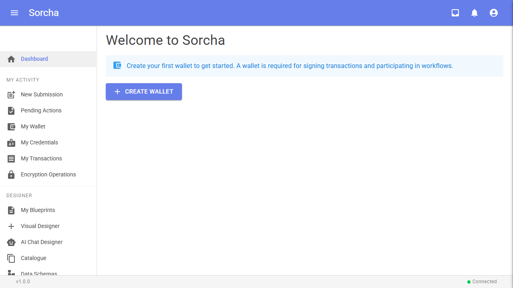 | System admin dashboard showing platform statistics (blueprints, wallets, transactions, peers, registers, organizations) |
|  | Organizations list showing the System Admin Org, Public Org, Government Identity Authority, and Council Licensing Authority |
|  | Government Identity Authority organization detail |
| 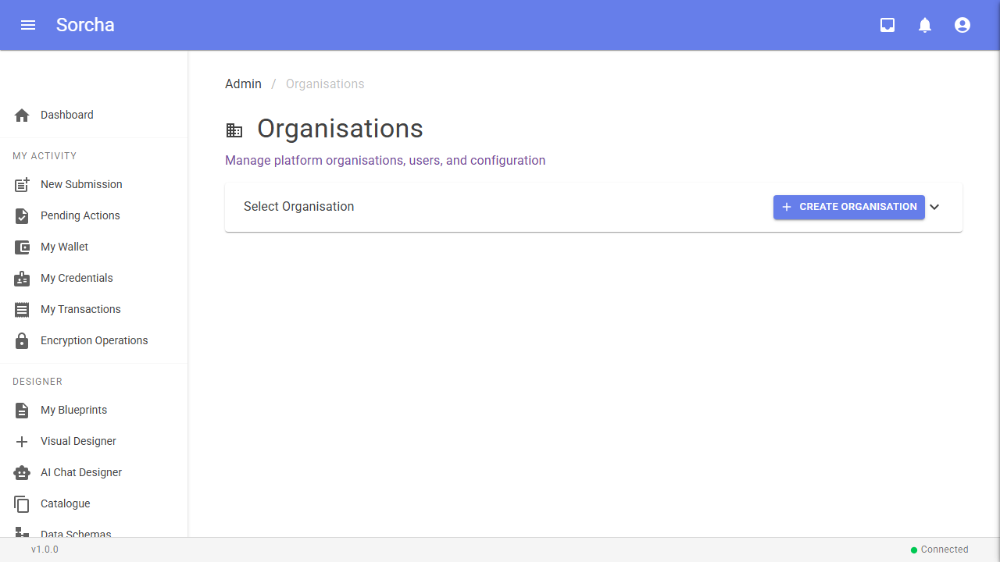 | Council Licensing Authority organization detail |

## Government Admin (Identity Issuer)

Logged in as `gov-admin@haip-walkthrough.local` under the Government Identity Authority organization.

| Screenshot | Description |
|---|---|
| 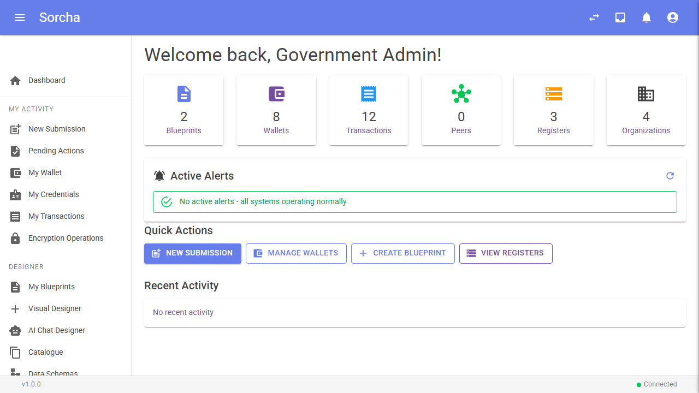 | Government admin dashboard with wallet and workflow statistics |
| 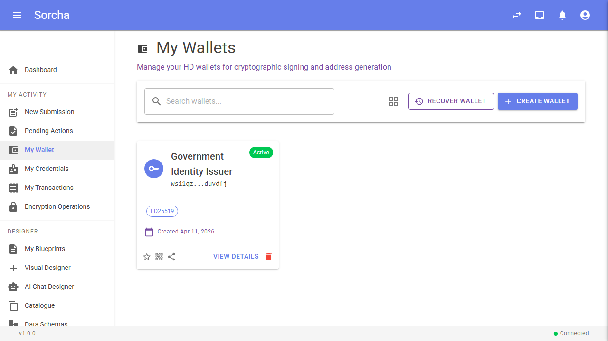 | Wallet page showing the "Government Identity Issuer" wallet used for signing VerifiedIdentityCredentials |
| 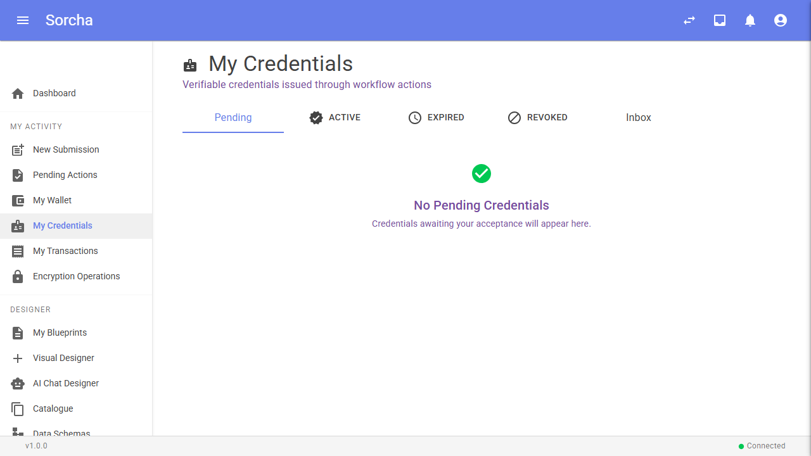 | Credentials page showing issued verifiable credentials |
|  | Pending actions view for government admin |
| 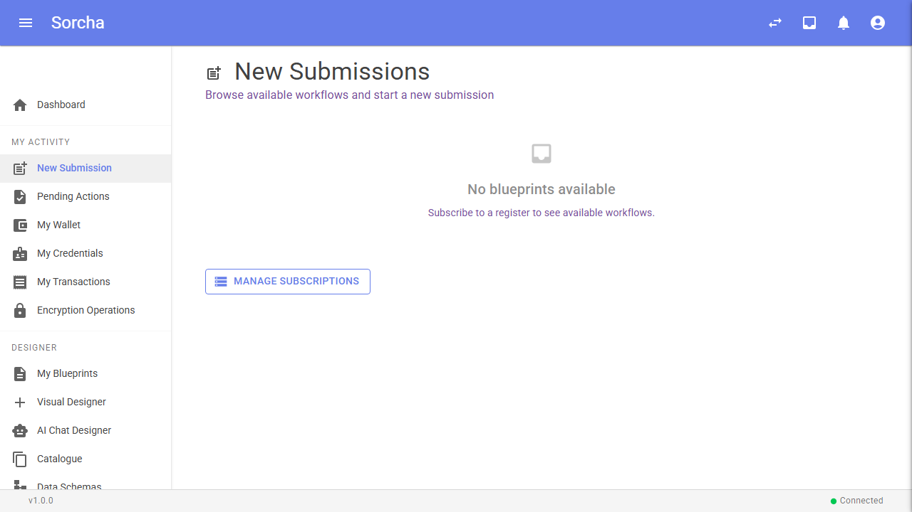 | Active workflows initiated by the government admin |

## Council Admin (Licence Issuer + Verifier)

Logged in as `council-admin@haip-walkthrough.local` under the Council Licensing Authority organization.

| Screenshot | Description |
|---|---|
| 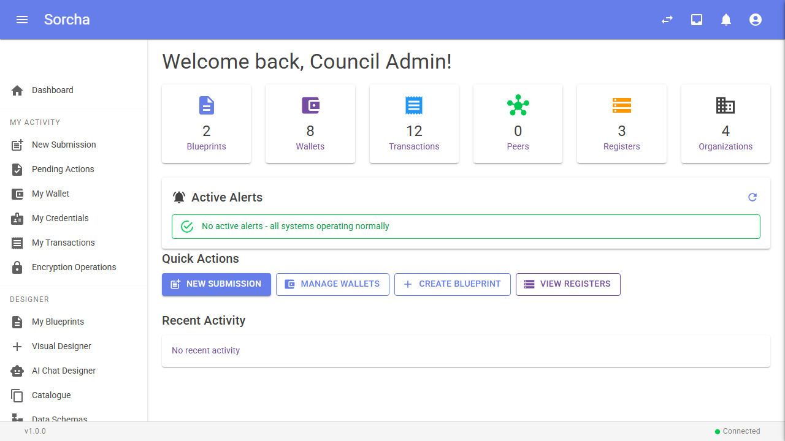 | Council admin dashboard with wallet and workflow statistics |
| 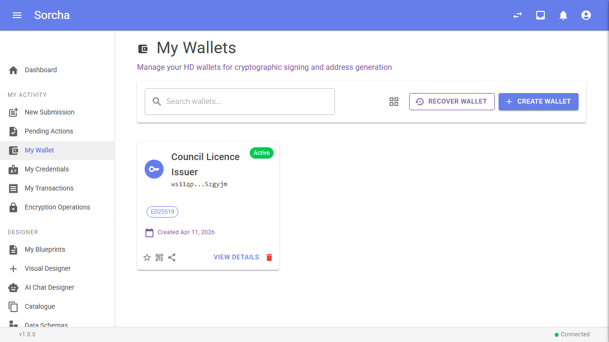 | Wallet page showing the "Council Licence Issuer" wallet |
| 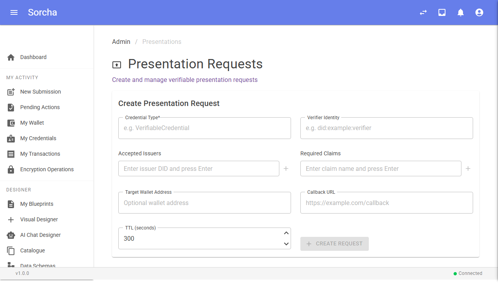 | Presentation requests page — the council uses this to create OID4VP presentation requests that verify a citizen's identity credential before issuing a driving licence |
|  | Credentials page showing issued DrivingLicenceCredentials |
| 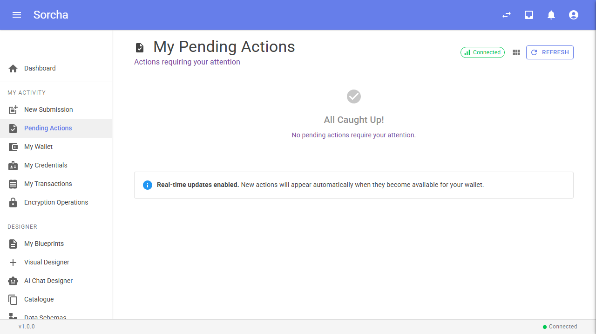 | Pending actions view for council admin |

## Citizen (Alice O'Brien)

Logged in as `alice.obrien@haip-walkthrough.local`. The citizen interacts with HAIP flows via an external wallet (the sorcha-agent CLI simulates this). The Sorcha UI shows available actions and the "Create Wallet" prompt since the HAIP wallet is external.

| Screenshot | Description |
|---|---|
| 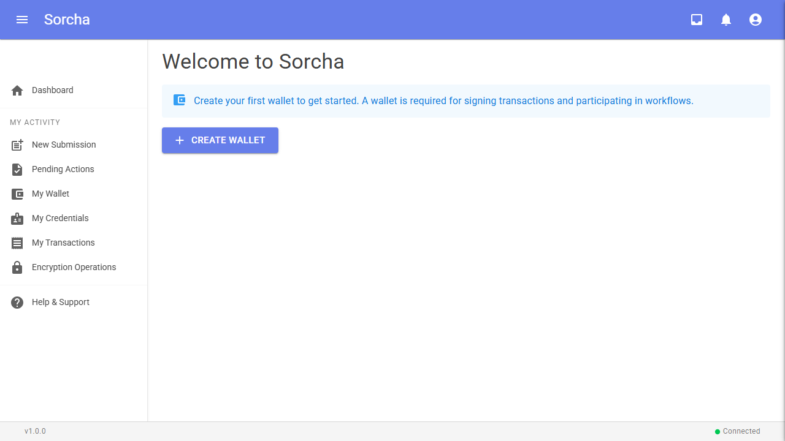 | Citizen dashboard prompting wallet creation (HAIP wallet is external, not a Sorcha wallet) |
| 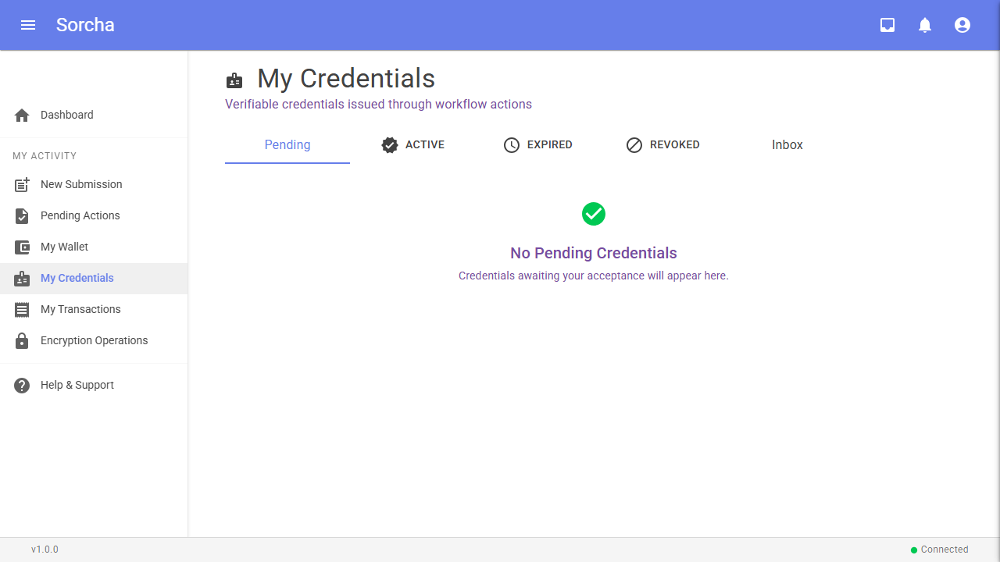 | Credentials page — pending, active, and inbox tabs for managing verifiable credentials |
| 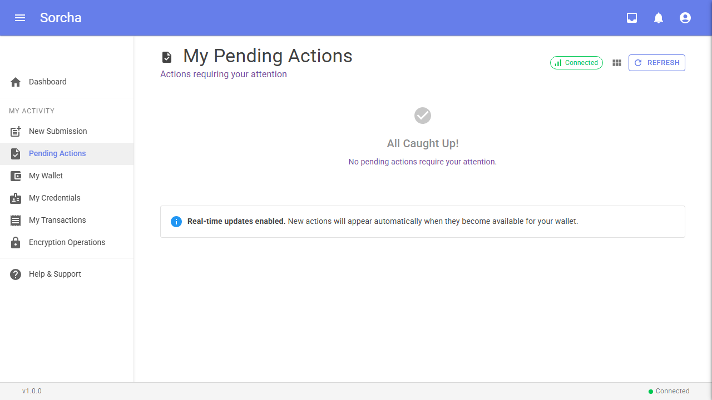 | Pending actions view for the citizen |
| 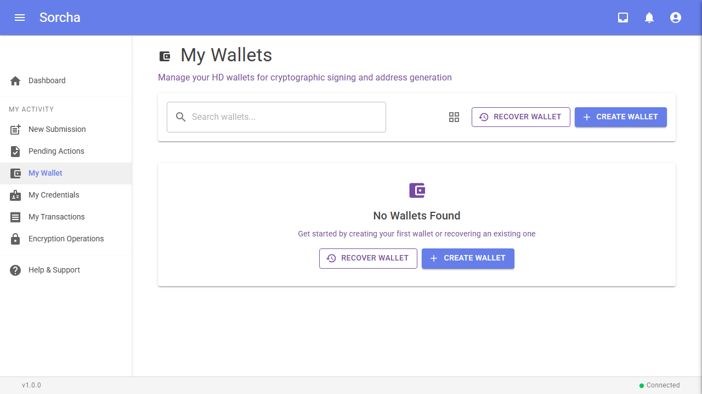 | Wallet page showing the wallet creation flow |

## HAIP Service Endpoints

Raw API responses from the HAIP OpenID4VCI/VP service, accessed via the API Gateway.

| Screenshot | Description |
|---|---|
| 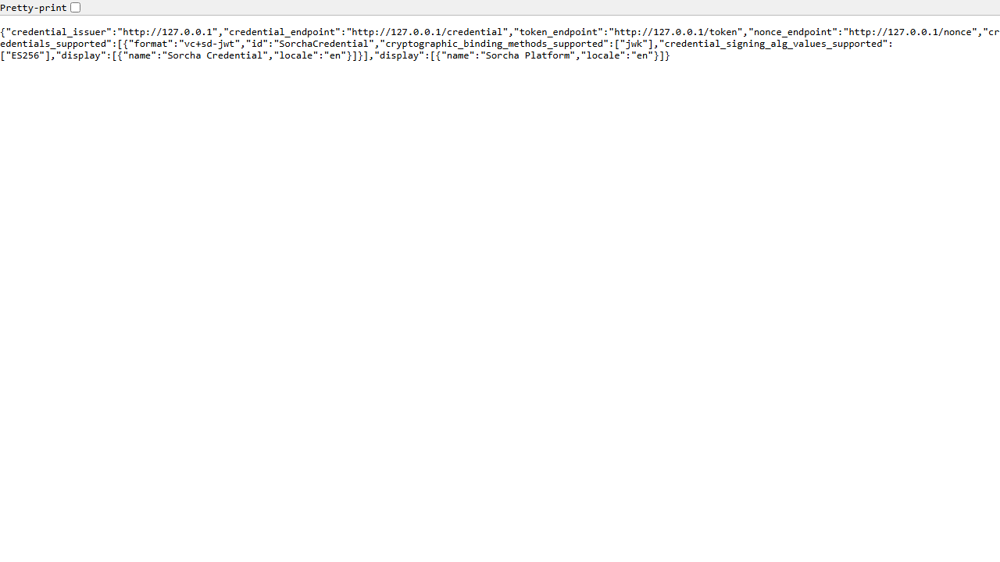 | `/.well-known/openid-credential-issuer` — OpenID4VCI issuer metadata advertising the credential endpoint, token endpoint, supported credential formats (vc+sd-jwt), and cryptographic binding methods (jwk with ES256) |
| 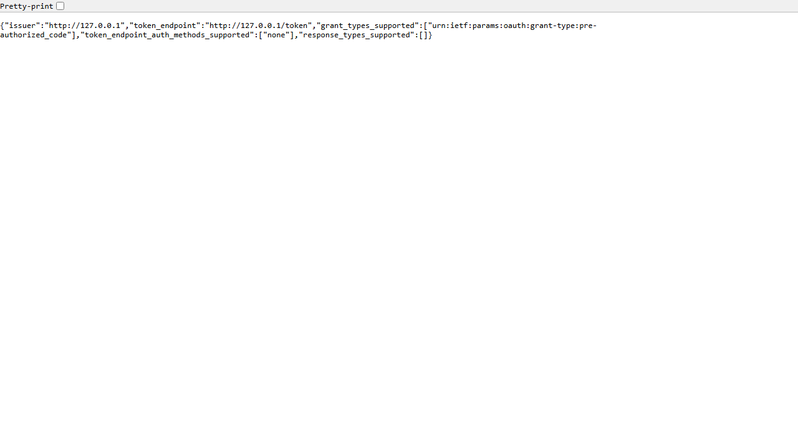 | `/.well-known/oauth-authorization-server` — OAuth 2.0 authorization server metadata for the pre-authorized code grant type |
|  | `/api/v1/nonce` — Nonce endpoint response used for proof-of-possession in credential requests |

## HAIP QR Components

The UI includes two QR code components for HAIP external wallet interactions:

- **CredentialOfferQrCard** — Renders an `openid-credential-offer://` URI as a QR code with issuer name, credential type, and expiry. Polls the offer status endpoint until the wallet scans and exchanges the credential (Pending -> Exchanged).

- **PresentationRequestQrCard** — Renders an `openid4vp://authorize?...` URI as a QR code with required credential type and requested claims. Polls the verification result endpoint until the wallet submits a VP token (Pending -> Submitted -> Verified).

Both components use server-side SVG QR generation (QRCoder) and are triggered from the action execution flow in MyActions.razor and NewSubmissionWorkspace.razor when a Blueprint action targets `HaipExternalWallet`.

---

*Generated: 2026-04-11 | Test class: `HaipWalkthroughScreenshotTests` (21 tests)*
