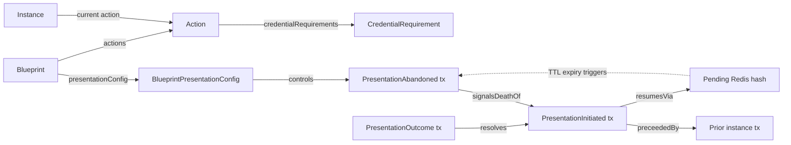

# Phase 1 Data Model: Timebound Presentation Lifecycle

**Feature**: 111-presentation-lifecycle
**Date**: 2026-04-23

## Scope

Three new on-register transaction types, one new transient Redis schema, three new blueprint configuration fields, one extended enum. No new database tables.

---

## 1. On-register transaction types

### 1.1 `PresentationInitiated` transaction

Added as a new value on `Sorcha.Register.Models.Enums.TransactionType`.

**Payload schema** (JSON, carried in the transaction body):

```jsonc
{
  "type": "presentation-initiated",
  "presentationRequestId": "9f7c2e1a-0b3d-4e5f-8a9b-c0d1e2f3a4b5",
  "instanceId": "78654d78-7470-4923-9a8b-71ba528639ff",
  "actionId": 3,
  "submitterWallet": "ws11q…",
  "consumerName": "haip",
  "requirementsDigest": "sha256:3a4b5c6d7e8f…",
  "validityWindowSeconds": 600,
  "timestamp": "2026-04-23T21:15:00Z"
}
```

**Invariants (enforced at build time)**:
- `presentationRequestId` is a freshly-generated Guid v4.
- `requirementsDigest` is the SHA-256 of the action's canonical `credentialRequirements` JSON.
- `consumerName` MUST match a registered `IPresentationConsumer.ConsumerName` in Blueprint Service.
- Transaction MUST NOT contain any credential content. (`RequiredClaims`, `Claims`, `Payload` fields absent.)

**RecipientsWallets**: the submitter wallet (for their own notification) + the wallets of any participant whose disclosure rule for the action includes the `presentation-initiated` event (default: none — initiated events are a public attempt record).

---

### 1.2 `PresentationOutcome` transaction

Added as a new value on `TransactionType`.

**Payload schema (success)**:

```jsonc
{
  "type": "presentation-outcome",
  "kind": "success",
  "presentationRequestId": "9f7c2e1a-…",
  "instanceId": "…",
  "actionId": 3,
  "submitterWallet": "ws11q…",
  "consumerName": "haip",
  "verifiedClaims": { "holderName": "…", "holderDateOfBirth": "…" },
  "presentationSubmissionHash": "sha256:…",
  "actionPayload": { /* the original action's non-credential fields, carried through */ },
  "timestamp": "2026-04-23T21:18:42Z"
}
```

**Payload schema (decline)**:

```jsonc
{
  "type": "presentation-outcome",
  "kind": "decline",
  "presentationRequestId": "9f7c2e1a-…",
  "instanceId": "…",
  "actionId": 3,
  "submitterWallet": "ws11q…",
  "consumerName": "haip",
  "reason": "expired-credential",
  "verifierDiagnostics": { /* present only when outcomeDetailLevel = "verbose" */ },
  "timestamp": "2026-04-23T21:16:30Z"
}
```

**Invariants**:
- `kind` is one of `success` | `decline`.
- `reason` MUST be present on decline, MUST be a member of `PresentationDeclineReason` enum.
- `verifiedClaims` MUST be present on success; encrypted via the register's normal pipeline per the action's disclosure rules.
- `verifierDiagnostics` MUST be absent when `outcomeDetailLevel = "minimal"`; optional when `"verbose"`.
- `actionPayload` on success equals the non-credential portion of the original action submission, stored in Redis at initiation and restored on outcome.

**State transition**: success advances the instance (normal downstream routing from action N to N+1). Decline terminates or reroutes per the blueprint's `rejectionConfig` — treated identically to a user-initiated rejection in the routing layer.

**RecipientsWallets**: same rules as a normal action transaction (submitter + whoever the action discloses to).

---

### 1.3 `PresentationAbandoned` transaction

Added as a new value on `TransactionType`.

**Payload schema**:

```jsonc
{
  "type": "presentation-abandoned",
  "presentationRequestId": "9f7c2e1a-…",
  "instanceId": "…",
  "actionId": 3,
  "submitterWallet": "ws11q…",
  "consumerName": "haip",
  "validityWindowSeconds": 600,
  "abandonedAt": "2026-04-23T21:25:00Z"
}
```

**Invariants**:
- Only written when the pending Redis state expires without a callback **and** the action's blueprint has `recordAbandonment: true`.
- MUST NOT be written if a `PresentationOutcome` for the same `presentationRequestId` already exists (guarded by the outcome-sentinel, see research R6).
- Late-outcome edge: abandoned can coexist with a subsequent outcome — both transactions stay on the register.

**RecipientsWallets**: submitter wallet only (no credential content, no new disclosure).

---

### 1.4 Transaction ordering and chain linkage

All three lifecycle transactions are first-class chain members. They carry `previousTxId` via the normal state reconstruction path (already correct as of PR #377). A typical chain for a single presentation:

```
action N-1 tx → presentation-initiated → (outcome OR abandoned [OR both on race])
```

Retry after decline extends the chain naturally:
```
… → presentation-initiated#1 → presentation-outcome#1 (decline)
                                                     → presentation-initiated#2 → presentation-outcome#2 (success) → action N+1
```

The action's completion signal is the **first `presentation-outcome` with `kind=success`** for the instance+action. Subsequent attempts after success are rejected at the submission endpoint with HTTP 409 (action already complete).

---

## 2. Transient state — Redis schema

### 2.1 Pending-presentation hash

**Key**: `sorcha:presentation:pending:{presentationRequestId}`
**Type**: Redis hash
**TTL**: `validityWindowSeconds` (default 600)
**Fields**:

| Field | Type | Description |
|---|---|---|
| `instanceId` | string (Guid) | Blueprint instance |
| `actionId` | string (int) | Action index within blueprint |
| `registerId` | string | Register owning the instance |
| `blueprintId` | string | Published blueprint id |
| `submitterWallet` | string | Wallet that initiated |
| `consumerName` | string | `haip` \| future consumer names |
| `draftPayload` | string (JSON) | Action's non-credential fields |
| `credentialRequirementDigest` | string (hex) | SHA-256 of the action's credential requirements |
| `delegationToken` | string (JWT) | Scoped token to resume action execution |
| `recordAbandonment` | string (bool) | Copied from blueprint config |
| `outcomeDetailLevel` | string | `minimal` \| `verbose` |
| `validityWindowSeconds` | string (int) | Copied from config |
| `createdAt` | string (ISO-8601) | Attempt creation timestamp |

### 2.2 Outcome sentinel

**Key**: `sorcha:presentation:outcome-sentinel:{presentationRequestId}`
**Type**: string
**TTL**: `validityWindowSeconds + 3600` (outlives pending hash to catch late callbacks)
**Values**:
- unset (no outcome or abandonment written yet)
- `"outcome-pending-write"` (callback in progress, writing outcome)
- `"success"` | `"decline"` (outcome written, kind recorded)
- `"abandoned"` (sweeper wrote abandonment)
- `"abandoned+outcome"` (late outcome arrived after abandonment; both on register)

### 2.3 Rate-limit counter

**Key**: `sorcha:presentation:ratelimit:{walletAddress}:{registerId}`
**Type**: integer
**TTL**: sliding window (default 600s, set on first INCR)
**Threshold**: 10 attempts/window (configurable via `PresentationLifecycleOptions.RateLimit.Threshold`)

### 2.4 Sweeper lock (HA deployments)

**Key**: `sorcha:presentation:sweeper-lock`
**Type**: string
**TTL**: 60s, renewed every 30s while held
**Value**: Blueprint Service instance id (hostname + pid)
**Purpose**: SET NX leader election among multiple Blueprint Service replicas; only the leader runs the abandonment sweep loop.

---

## 3. Blueprint configuration — three new fields

### 3.1 `BlueprintPresentationConfig` record

New record in `src/Common/Sorcha.Blueprint.Models/BlueprintPresentationConfig.cs`:

```csharp
public record BlueprintPresentationConfig
{
    public bool RecordAbandonment { get; init; } = false;
    public OutcomeDetailLevel? OutcomeDetailLevel { get; init; } = null;   // null = use register-visibility default
    public int? PresentationValidityWindowSeconds { get; init; } = null;   // null = use platform default (600)
}

public enum OutcomeDetailLevel { Minimal, Verbose }
```

### 3.2 Placement in blueprint schema

Added to the blueprint root object as an optional field:

```jsonc
{
  "id": "example-blueprint-v1",
  "title": "...",
  "presentationConfig": {
    "recordAbandonment": true,
    "outcomeDetailLevel": "minimal",
    "presentationValidityWindowSeconds": 600
  },
  "actions": [ … ]
}
```

JSON schema additions to `Sorcha.Blueprint.Core` JsonSchema definitions. No breaking change to existing blueprints — field is optional with platform defaults.

### 3.3 Platform-default resolution precedence (highest → lowest)

1. Per-blueprint `presentationConfig.*` value (if set).
2. Per-register default (for `outcomeDetailLevel`: `advertise=true` → `Minimal`, else `Verbose`).
3. Platform default (`RecordAbandonment=false`, `PresentationValidityWindowSeconds=600`).

---

## 4. Extended enums

### 4.1 `Sorcha.Register.Models.Enums.TransactionType`

Add three values:
- `PresentationInitiated`
- `PresentationOutcome`
- `PresentationAbandoned`

### 4.2 `Sorcha.PresentationLifecycle.Abstractions.PresentationOutcomeKind`

New enum:
- `Success`
- `Decline`

### 4.3 `Sorcha.PresentationLifecycle.Abstractions.PresentationDeclineReason`

New enum (closed set):
- `ExpiredCredential`
- `WrongIssuer`
- `Revoked`
- `SchemaMismatch`
- `SignatureInvalid`
- `ActionNoLongerAvailable` (open-participant race — another citizen bound first)
- `VerifierError` (catch-all for infrastructure failures, only set by consumer when none of the above fit)

---

## 5. Validation rules (derived from functional requirements)

| Rule | FR reference | Enforced in |
|---|---|---|
| `PresentationInitiated` MUST NOT carry credential data | FR-002 | `TransactionBuilderService.BuildPresentationInitiatedAsync` + JSON schema |
| Exactly one `PresentationOutcome` per requestId (idempotent) | FR-005, FR-006 | Outcome sentinel (Redis SET NX) |
| `PresentationAbandoned` MUST NOT be written if outcome exists | FR-008 | Sweeper checks outcome sentinel before write |
| Late outcome after abandonment MUST still write | FR-009 | Callback path overrides NX when sentinel = `"abandoned"` |
| Retry produces new requestId | FR-010 | Endpoint issues fresh Guid on every attempt submission |
| Per-wallet-per-register rate limit | FR-011 | Redis INCR + TTL before attempt transaction write |
| Callback requestId must match active pending (CSRF) | FR-012 | Verifier callback endpoint checks pending-hash existence |
| Action complete only on outcome=success | FR-015 | `PresentationLifecycleService.HandleOutcomeAsync` branches routing; initiated alone does not advance instance |

---

## 6. Entity relationships summary



No new tables; all persistence is either on the register (transactions) or in Redis (transient).
