# Construction Permit Approval — Walkthrough

A multi-organisation construction permit workflow demonstrating Sorcha's core capabilities: per-user authentication, encrypted transactions, conditional routing, JSON Logic calculations, rejection paths, and verifiable credential issuance.

**4 organisations | 5 participants | 6 actions | 3 scenarios**

---

## The Scenario

**Meridian Construction** submits a building application that flows through structural assessment, council planning review, optional environmental review (for high-risk builds), building control inspection, and final permit issuance.

| Organisation | Participant | Role |
|---|---|---|
| Meridian Construction | Site Manager | Submits building application |
| Apex Structural Engineers | Lead Engineer | Structural assessment + risk score |
| Riverside Borough Council | Planning Officer | Zoning review + final approval |
| Riverside Borough Council | Building Control Inspector | Technical inspection + permit fee |
| Green Valley Environmental | Environmental Consultant | Environmental impact (high-risk only) |

---

## Part 1: Platform Setup

### 1.1 Sign In

Users authenticate with email/password, passkey, or social login (Google, Microsoft, GitHub, Apple).

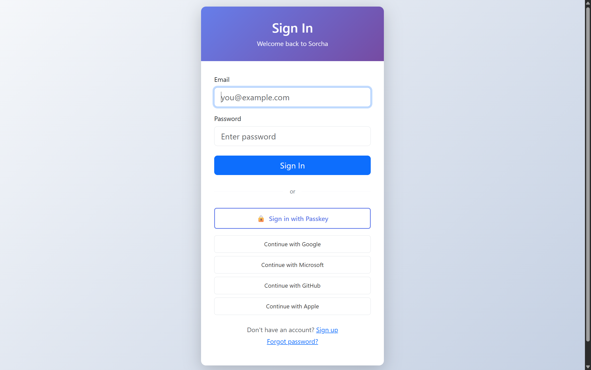

### 1.2 User Registration

New users self-register on the public organisation. The walkthrough setup script creates all 5 participants programmatically via the same API.

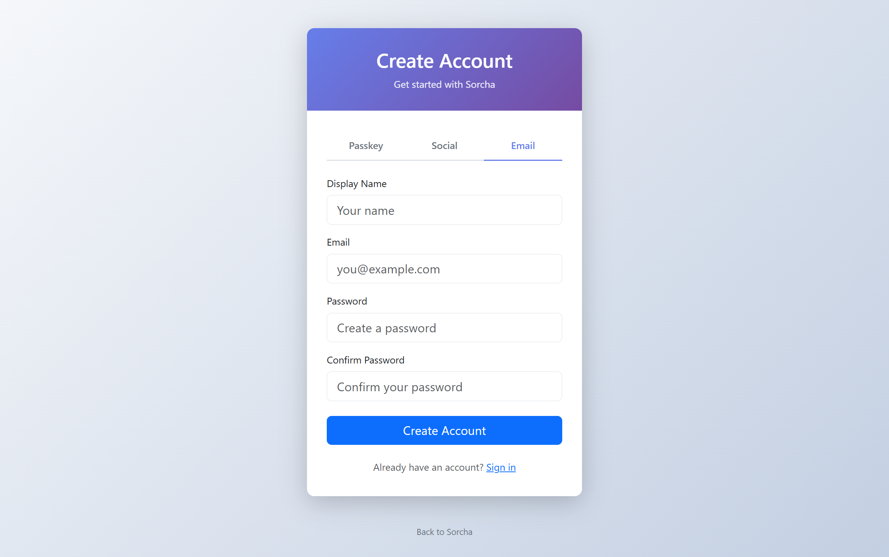

### 1.3 Organisation Selection

Multi-org users select which organisation to sign in to. The contractor belongs to both the public org and Meridian Construction.

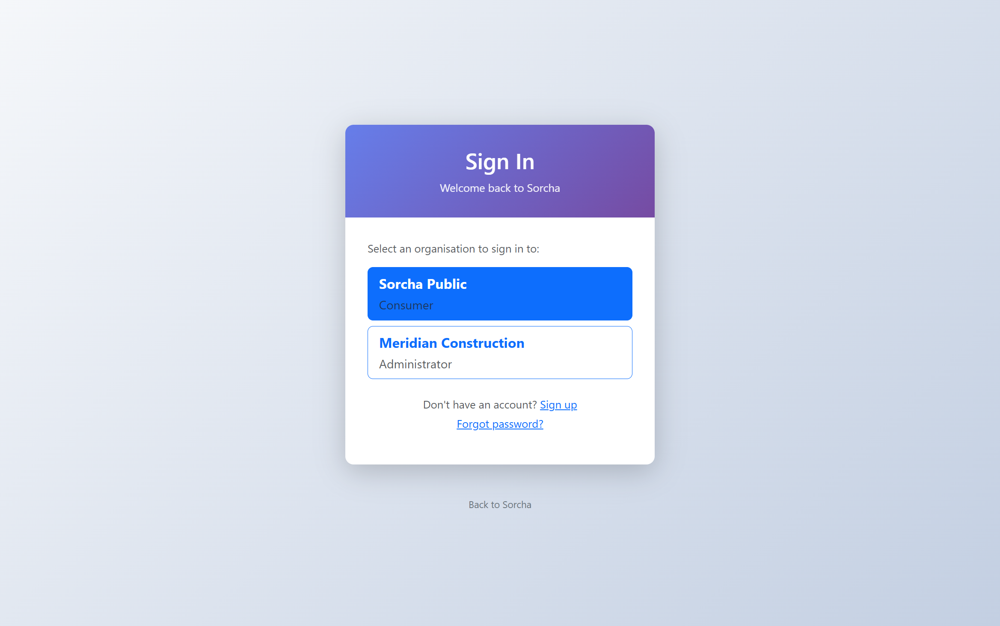

### 1.4 Dashboard

After login, the dashboard shows platform stats: blueprints, wallets, transactions, peers, registers, and organisations. Quick actions provide shortcuts to common tasks.

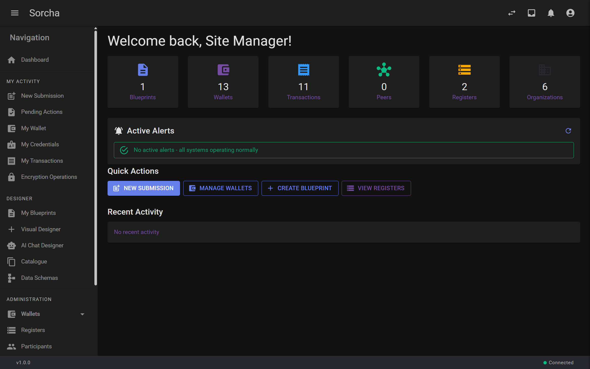

### 1.5 Wallet

Each participant has an ED25519 HD wallet for cryptographic signing. Wallets are linked to participant identities via a challenge-sign-verify protocol.

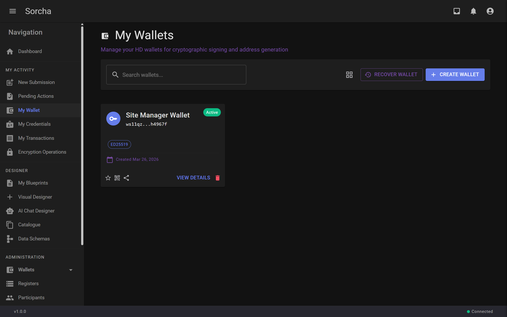

### 1.6 Blueprint

The Construction Permit Approval blueprint defines 6 actions, 5 participants, conditional routing rules, JSON Logic calculations, disclosure rules, and data schemas.

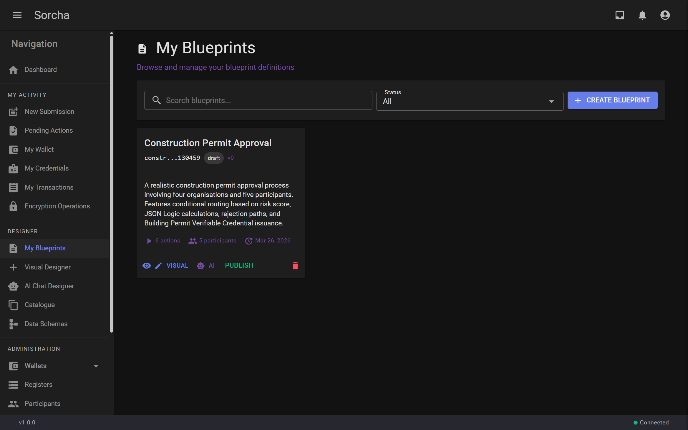

### 1.7 Register

The Construction Permit Register is the distributed ledger where all transactions are recorded. The register owner (Meridian Construction) creates it; other organisations subscribe.

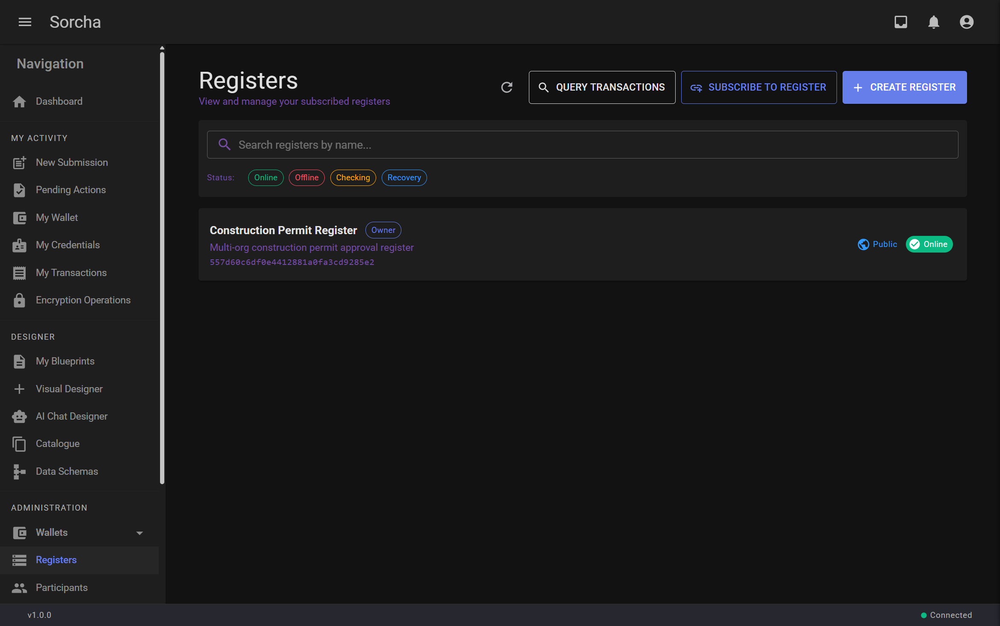

### 1.8 Participants

Participant identities are published to the register, linking wallet addresses to display names and organisations. This enables cross-org participant discovery.

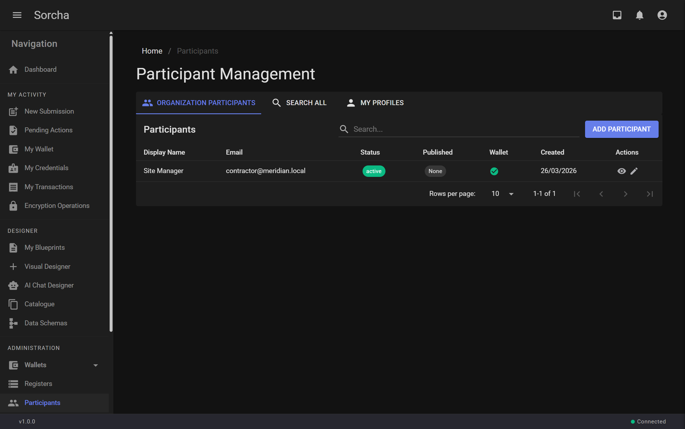

---

## Part 2: Workflow Execution

The walkthrough executes three scenarios against the published blueprint. Each scenario creates a new workflow instance and processes actions through the encrypted transaction pipeline.

### Workflow Diagram

```
[1] Submit Application ──> [2] Structural Assessment ──> [3] Planning Review
     (contractor)              (structural-engineer)         (planning-officer)
                                                                    |
                                                        ┌───────────┴───────────┐
                                                   riskScore >= 7          riskScore < 7
                                                        |                       |
                                               [4] Environmental        [5] Building Control
                                                   Assessment               Inspection
                                               (env-assessor)           (building-control)
                                                        |                       |
                                                        └───────────┬───────────┘
                                                                    |
                                                          [6] Final Approval
                                                           (planning-officer)
                                                                    |
                                                         Building Permit VC
```

### Scenario A: Low-Risk Residential (5 actions)

3-storey residential, 800 m2, risk score 6.1 — **skips environmental review**.

| Step | Action | Participant | Key Data |
|---|---|---|---|
| 1 | Submit Application | Site Manager (Meridian) | "Riverside Heights", 3 storeys, residential, 500k |
| 2 | Structural Assessment | Lead Engineer (Apex) | Grade B, strip foundations, risk score **6.1** |
| 3 | Planning Review | Planning Officer (Council) | Zoning compliant, routes to building control |
| 4 | Building Control | Inspector (Council) | All compliant, permit fee **2,200** |
| 5 | Final Approval | Planning Officer (Council) | **Approved** — Building Permit VC issued |

### Scenario B: High-Risk Commercial (6 actions)

8-storey commercial, 3500 m2, risk score 22.8 — **triggers environmental review**.

| Step | Action | Participant | Key Data |
|---|---|---|---|
| 1 | Submit Application | Site Manager (Meridian) | "Central Business Tower", 8 storeys, commercial, 5M |
| 2 | Structural Assessment | Lead Engineer (Apex) | Grade A, piled foundations, risk score **22.8** |
| 3 | Planning Review | Planning Officer (Council) | Zoning compliant, routes to **environmental** |
| 4 | Environmental Assessment | Consultant (Green Valley) | Medium impact, mitigation required |
| 5 | Building Control | Inspector (Council) | All compliant, permit fee **15,250** |
| 6 | Final Approval | Planning Officer (Council) | **Approved** with environmental conditions |

### Scenario C: Rejection (3 actions)

4-storey commercial in Green Belt zone — **rejected at planning review**.

| Step | Action | Participant | Key Data |
|---|---|---|---|
| 1 | Submit Application | Site Manager (Meridian) | "Eastside Commercial Centre", 4 storeys, commercial |
| 2 | Structural Assessment | Lead Engineer (Apex) | Grade B, raft foundations |
| 3 | Planning Review | Planning Officer (Council) | **Rejected** — Green Belt zone, height exceeds limit |

### New Submission View

The UI presents available blueprints published to subscribed registers. Users click START to create a new workflow instance.

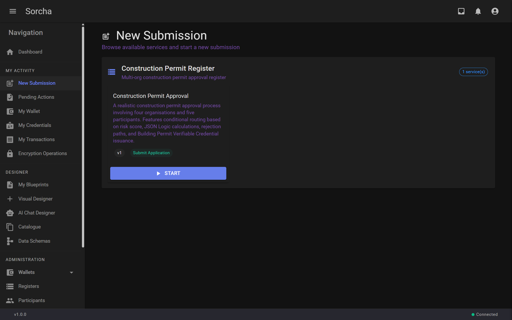

### Action 1: Contractor Submits Application

The contractor (Site Manager, Meridian Construction) fills in project details — name, address, building type, estimated value, floor area, and storeys — via a schema-driven form. The data is validated client-side against the blueprint's JSON Schema before submission.

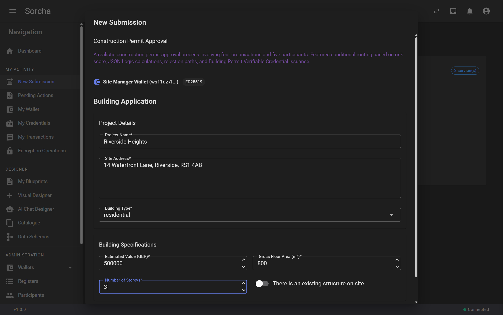

### Action 2: Structural Engineer Reviews

After the contractor submits, Action 2 appears in the structural engineer's Pending Actions. The Lead Engineer (Apex Structural Engineers) sees the action card and clicks TAKE ACTION to provide their structural assessment — load rating, foundation type, structural grade, and notes. The system calculates a **risk score** (6.1 for this low-risk residential) that drives conditional routing downstream.

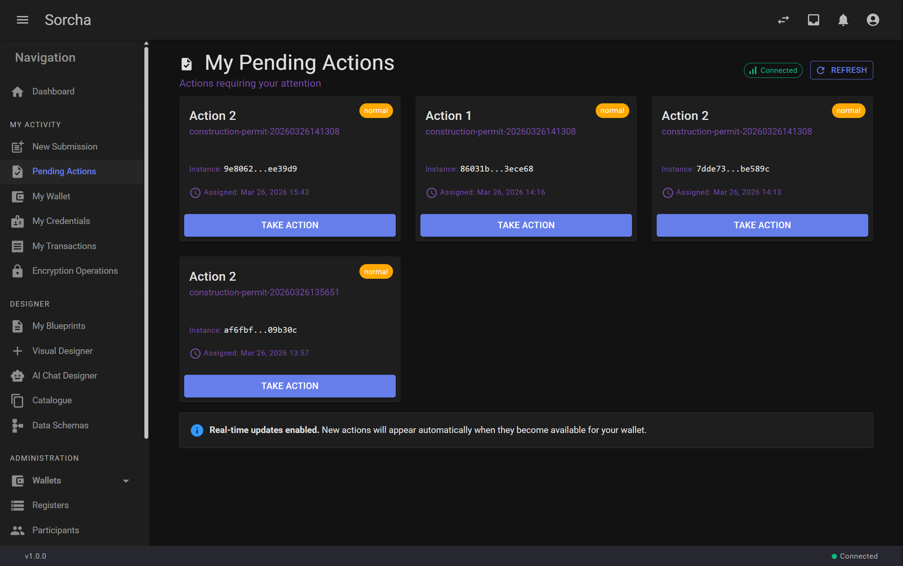

### Action 3: Planning Officer Reviews

The Planning Officer (Riverside Borough Council) receives Action 3 after the structural assessment. They review the application for zoning compliance. Because the risk score is below 7, the workflow routes directly to Building Control (Action 5), **skipping environmental review**.

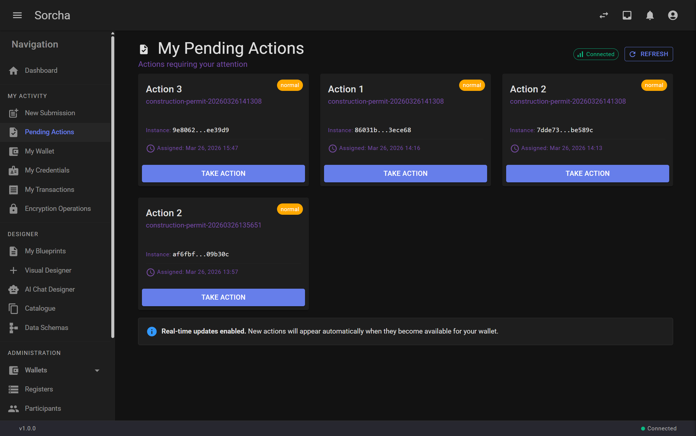

### Action 5: Building Control Inspection

The Building Control Inspector (also Riverside Borough Council, but a different user) sees Action 5. They verify structural approval, fire compliance, and accessibility. The system calculates a **permit fee** (£2,200 for this residential build).


### Action 6: Final Approval

The Planning Officer returns for final approval (Action 6). They issue the permit number, set validity dates, and attach conditions. Upon approval, a **Building Permit Verifiable Credential** is issued to the contractor.


### Encryption Operations

Every action's payload is encrypted per-recipient using X25519 before being written to the ledger. The Encryption Operations view tracks each operation's progress.

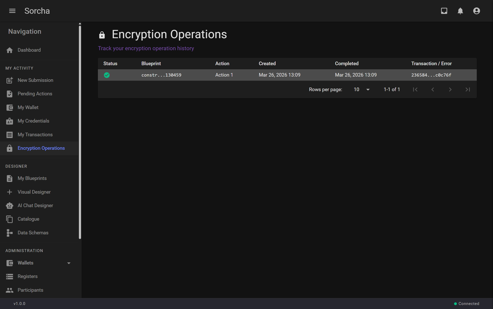

### Aspire Dashboard

The .NET Aspire dashboard provides structured logging, distributed tracing, and health monitoring across all microservices.

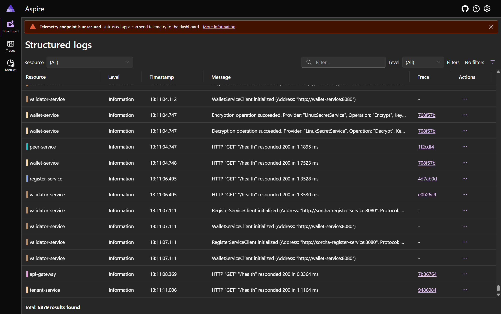

---

## Part 3: Pipeline Metrics

Measured across 10 consecutive rounds (30 scenario executions):

| Metric | Value |
|---|---|
| **Pass rate** | 30/30 (100%) |
| **Scenario A** (5 actions) | ~20s |
| **Scenario B** (6 actions) | ~36s |
| **Scenario C** (3 actions, rejection) | ~27s |
| **Full round** (A + B + C) | ~100s |
| **Docket build cadence** | 6s steady-state |
| **Action 1 latency** | 25-69ms |
| **Mid-workflow action latency** | 5-6s (docket confirmation) |

### Per-Action Breakdown

| Action | Latency | Bottleneck |
|---|---|---|
| Submit Application | 25-69ms | None (first action) |
| Structural Assessment | 5-12s | Waits for docket confirmation |
| Planning Review | ~6s | Docket cycle |
| Environmental Assessment | ~6s | Docket cycle |
| Building Control | ~6s | Docket cycle |
| Final Approval | 17-33ms | Last action, immediate |

---

## Running the Walkthrough

```powershell
# Prerequisites: Docker Desktop, PowerShell 7.5+

# Start services (fresh)
docker-compose up -d

# Generate secrets (first time only)
pwsh walkthroughs/initialize-secrets.ps1

# Setup: creates 4 orgs, 5 users, wallets, register, blueprint
pwsh walkthroughs/ConstructionPermit/setup.ps1

# Run all 3 scenarios
pwsh walkthroughs/ConstructionPermit/run.ps1

# Run a specific scenario
pwsh walkthroughs/ConstructionPermit/run.ps1 -Scenario A

# Re-run setup (skips if state is valid, use -Force to recreate)
pwsh walkthroughs/ConstructionPermit/setup.ps1
pwsh walkthroughs/ConstructionPermit/setup.ps1 -Force
```

---

## Architecture

```
┌─────────────┐     ┌─────────────────┐     ┌──────────────────┐
│  Sorcha UI  │────>│   API Gateway   │────>│  Blueprint Svc   │
│  (Blazor)   │     │    (YARP)       │     │  (Workflows)     │
└─────────────┘     └─────────────────┘     └────────┬─────────┘
                            │                         │
                    ┌───────┴───────┐        ┌───────┴────────┐
              ┌─────▼─────┐   ┌─────▼─────┐  │  ┌────────────▼┐
              │  Wallet   │   │ Register  │<─┘  │  Validator  │
              │  Service  │   │  Service  │     │   Service   │
              └─────┬─────┘   └─────┬─────┘     └─────────────┘
              │PostgreSQL │   │  MongoDB  │     │   Redis     │
```

Each action execution flows through: **Blueprint Service** (validate + encrypt) → **Validator Service** (validate + docket) → **Register Service** (confirm on ledger) → **Blueprint Service** (advance instance).

---

## Known Issues

| Issue | Impact | Status |
|---|---|---|
| **Execute Action form empty** | The "Take Action" dialog on Pending Actions shows an empty form — `WorkflowService.GetPendingActionsAsync()` does not populate `DataSchema` on the `PendingActionViewModel`. The form renderer requires the schema to generate fields. | Open — fix: fetch blueprint action schema when opening the Execute Action dialog. |
