# Sorcha platform — walkthrough storyboard

Captured against the local Docker stack at `http://localhost:80` on 2026-06-29 23:59 (local).

Signed in as `admin@sorcha.local`. 12 screens captured.

> Note: images were built before the M0 verifier fix / M1 AIAS demo merges, so this reflects the platform shell, not those features.

---

## 1. Dashboard

Landing surface after sign-in — the operator's home.

- **Route:** `/app/dashboard`
- **Resolved URL:** http://localhost/app/dashboard
- **Page title:** Dashboard - Sorcha
- **State:** captured
- **Captured:** 23:59:58

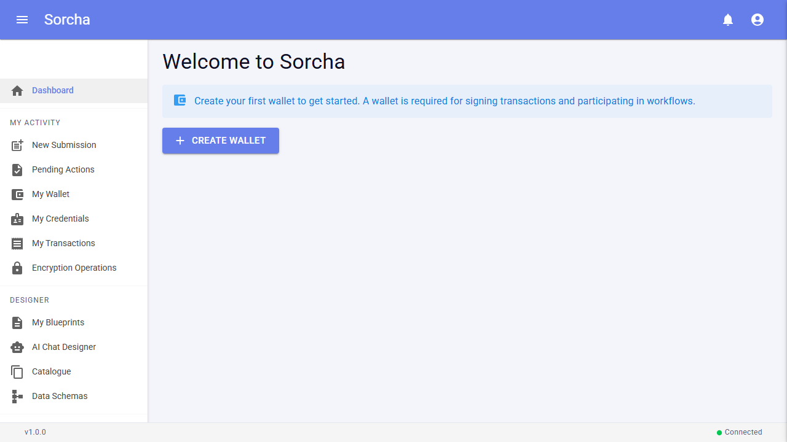

---

## 2. AI Blueprint Designer

The Describe → Understand → Rehearse → Go-live workflow designer shell.

- **Route:** `/app/designer/blueprint`
- **Resolved URL:** http://localhost/app/designer/blueprint
- **Page title:** Sorcha Platform
- **State:** captured
- **Captured:** 00:00:00

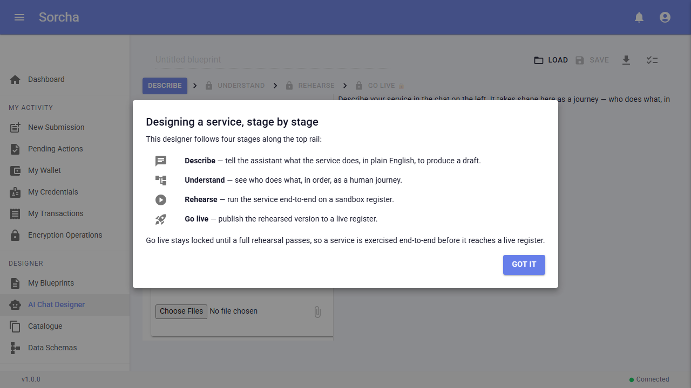

---

## 3. Blueprints

Published workflow definitions.

- **Route:** `/app/blueprints`
- **Resolved URL:** http://localhost/app/blueprints
- **Page title:** My Blueprints - Sorcha Platform
- **State:** captured
- **Captured:** 00:00:03

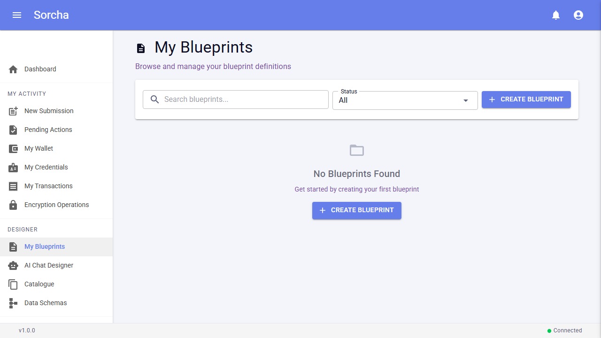

---

## 4. Templates

Reusable blueprint templates.

- **Route:** `/app/templates`
- **Resolved URL:** http://localhost/app/templates
- **Page title:** Catalogue - Sorcha Platform
- **State:** captured
- **Captured:** 00:00:05

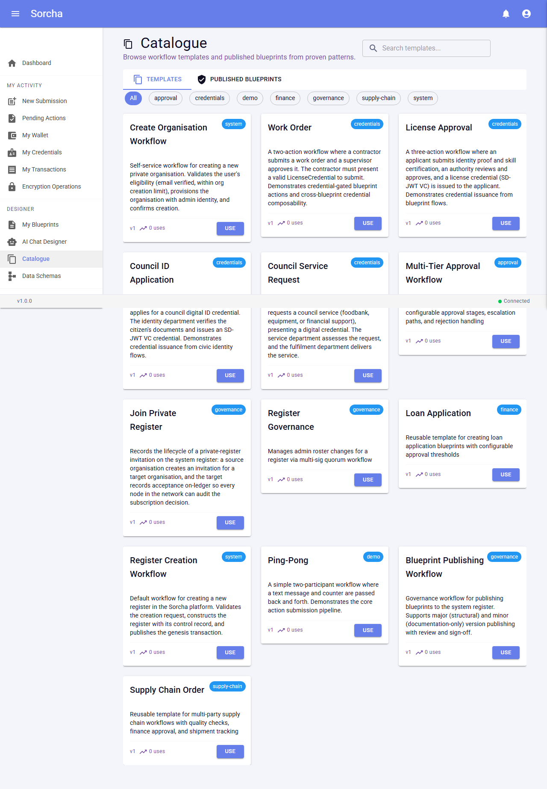

---

## 5. Schema Library

Core + external JSON schemas available to blueprints.

- **Route:** `/app/schemas`
- **Resolved URL:** http://localhost/app/schemas
- **Page title:** Schema Library - Sorcha Platform
- **State:** captured
- **Captured:** 00:00:08

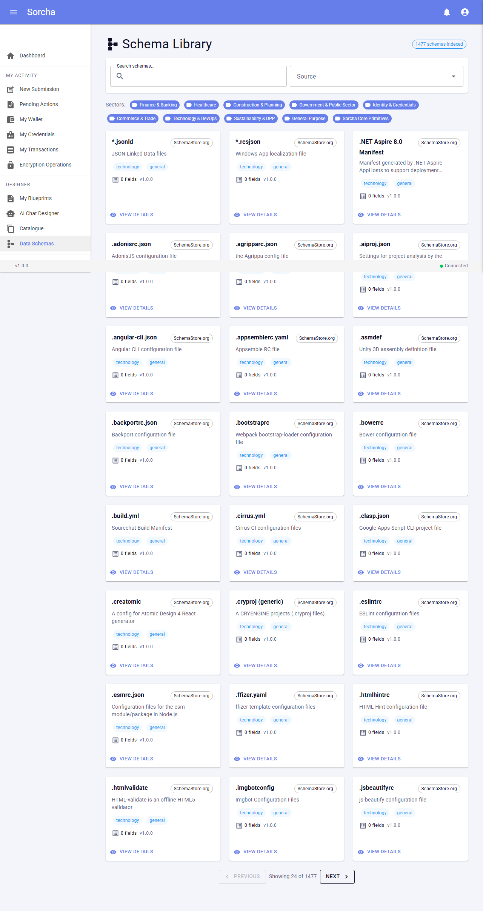

---

## 6. Registers

Distributed-ledger registers (the immutable record).

- **Route:** `/app/registers`
- **Resolved URL:** http://localhost/app/registers
- **Page title:** Registers - Sorcha
- **State:** captured
- **Captured:** 00:00:10

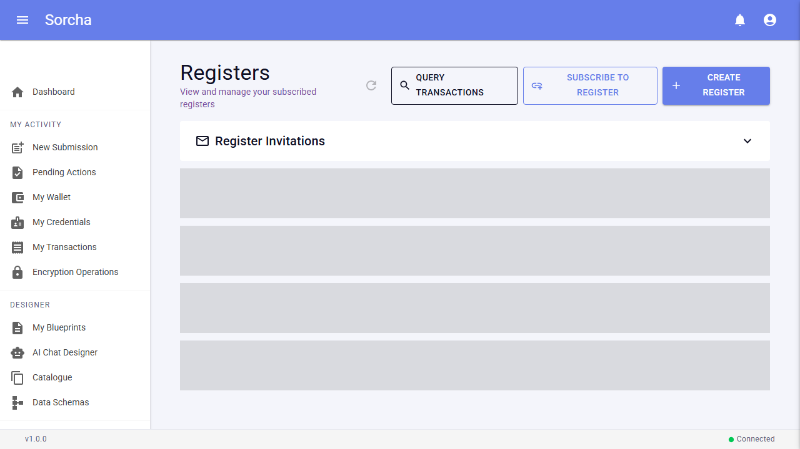

---

## 7. Wallets

HD wallets / crypto identities.

- **Route:** `/app/wallets`
- **Resolved URL:** http://localhost/app/wallets
- **Page title:** My Wallets - Sorcha Platform
- **State:** captured
- **Captured:** 00:00:12

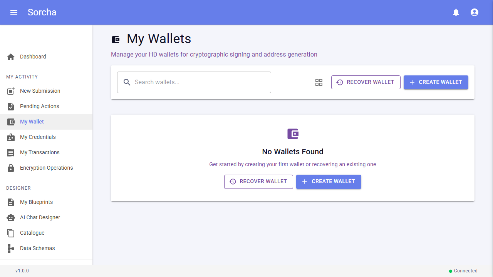

---

## 8. My Actions

Pending workflow actions awaiting the signed-in participant.

- **Route:** `/app/my-actions`
- **Resolved URL:** http://localhost/app/my-actions
- **Page title:** My Pending Actions - Sorcha Platform
- **State:** captured
- **Captured:** 00:00:14

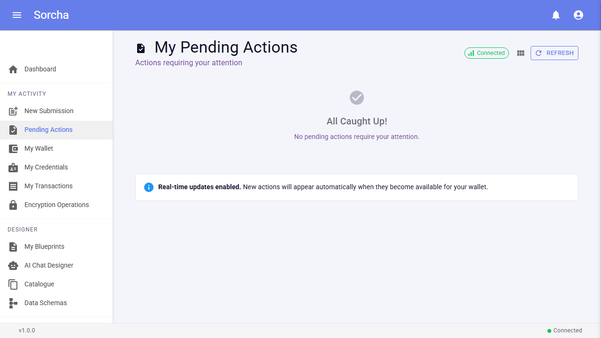

---

## 9. Credentials

Held verifiable credentials.

- **Route:** `/app/credentials`
- **Resolved URL:** http://localhost/app/credentials
- **Page title:** My Credentials - Sorcha Platform
- **State:** captured
- **Captured:** 00:00:16

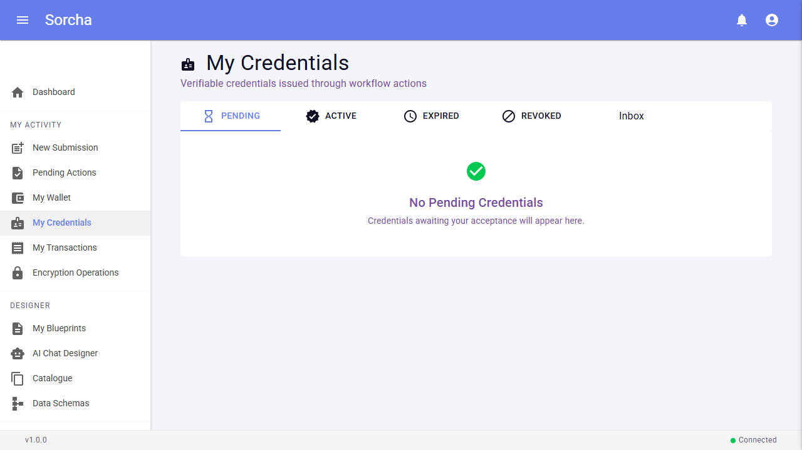

---

## 10. Admin · Health

Service + storage-provider health overview.

- **Route:** `/app/admin/health`
- **Resolved URL:** http://localhost/app/admin/health
- **Page title:** System Health - Sorcha Platform
- **State:** captured
- **Captured:** 00:00:19

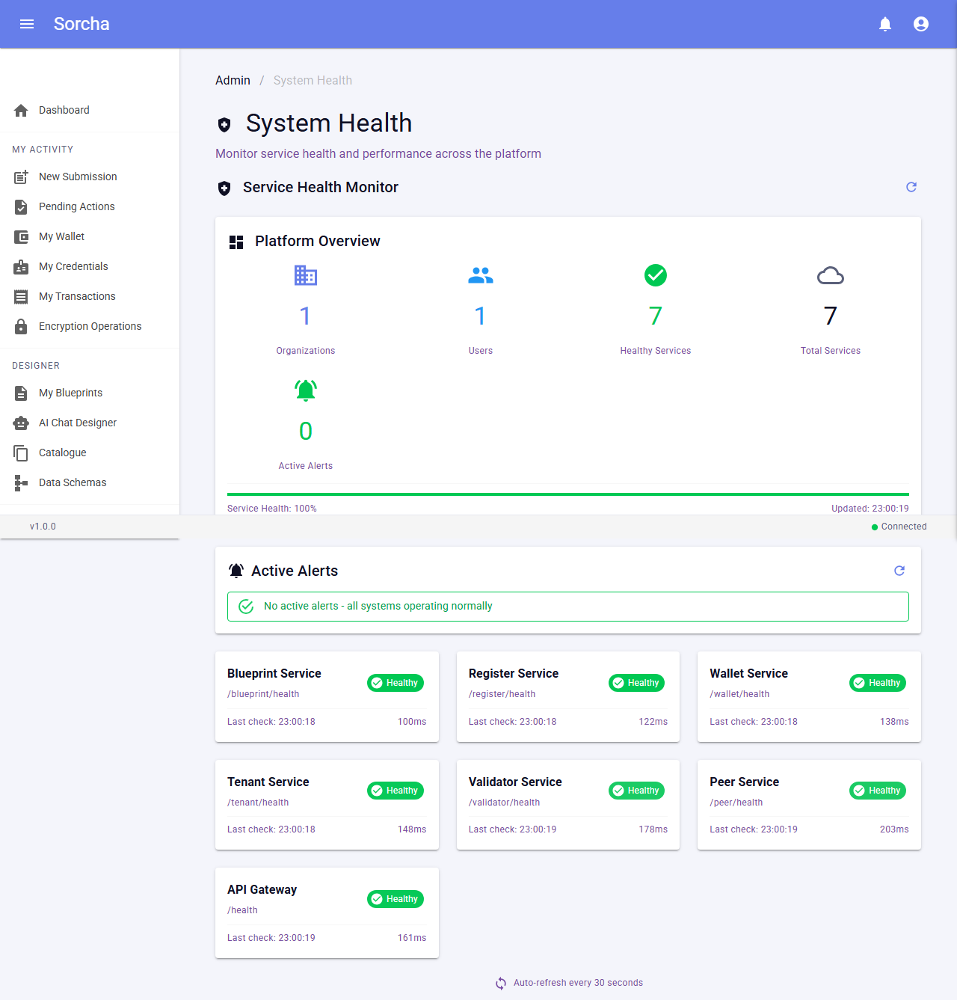

---

## 11. Admin · Organisations

Tenant orgs (System Admin + auto-seeded Public org).

- **Route:** `/app/admin/organizations`
- **Resolved URL:** http://localhost/app/admin/organizations
- **Page title:** Organisations - Sorcha Platform
- **State:** captured
- **Captured:** 00:00:21

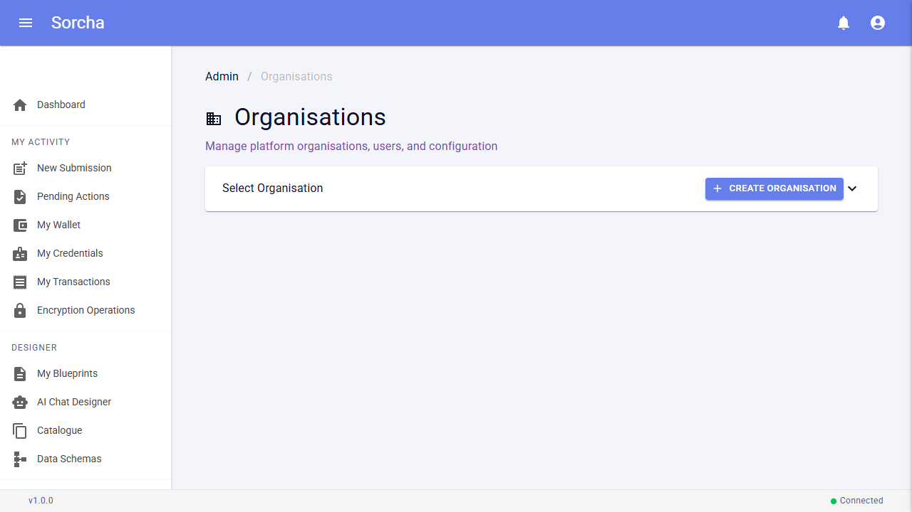

---

## 12. Settings

User / platform settings.

- **Route:** `/app/settings`
- **Resolved URL:** http://localhost/app/settings
- **Page title:** Settings - Sorcha Platform
- **State:** captured
- **Captured:** 00:00:24

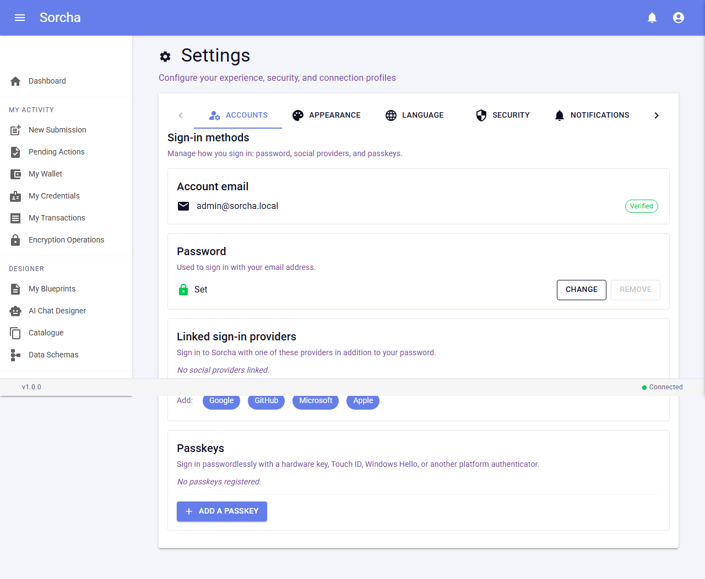

---

